# Life OS Fullstack Architecture Document

**Version:** 1.0
**Date:** 2025-01-30
**Status:** Ready for Implementation
**Project:** Life OS - Comprehensive Health Tracking Platform

---

## Introduction

This document outlines the complete fullstack architecture for Life OS, including backend systems, frontend implementation, and their integration. It serves as the single source of truth for AI-driven development, ensuring consistency across the entire technology stack.

This unified approach combines what would traditionally be separate backend and frontend architecture documents, streamlining the development process for modern fullstack applications where these concerns are increasingly intertwined.

### Starter Template or Existing Project

**Status:** Greenfield project - No starter template

This is a greenfield Next.js 14+ application built from scratch with Supabase as the backend. We're not using any fullstack starter templates, allowing us to maintain full control over the architecture while following Next.js and Supabase best practices.

### Change Log

| Date | Version | Description | Author |
|------|---------|-------------|--------|
| 2025-01-30 | 1.0 | Initial fullstack architecture for Life OS | Winston (Architect) |

---

## High Level Architecture

### Technical Summary

Life OS is a serverless full-stack application built on Next.js 14+ (React 18) with Supabase as the backend-as-a-service platform. The architecture follows a **Jamstack + Serverless** pattern where the frontend is deployed as a static/server-rendered application on Vercel's edge network, while backend services (database, authentication, real-time subscriptions, storage) are managed entirely by Supabase. This eliminates devops overhead while providing enterprise-grade security through Row Level Security policies and real-time data synchronization across devices. The application uses TypeScript throughout for type safety, with shared types between client and server. Data flows directly from browser to Supabase using the Supabase client SDK, with Next.js Server Components and API Routes handling server-side operations when needed. This architecture achieves the PRD's goals of multi-device access, real-time analytics, and secure multi-user isolation while maintaining developer velocity and zero infrastructure management.

### Platform and Infrastructure Choice

**Platform:** Vercel + Supabase

**Key Services:**
- **Frontend Hosting**: Vercel (Edge Network, automatic scaling, zero-config)
- **Database**: Supabase PostgreSQL (managed, auto-scaling)
- **Authentication**: Supabase Auth (email/password, OAuth, magic links)
- **Storage**: Supabase Storage (Winners Bible images, profile pictures)
- **Real-time**: Supabase Realtime (WebSocket subscriptions for live data)
- **Edge Functions**: Supabase Edge Functions (Deno runtime, if needed for complex server logic)

**Deployment Host and Regions:**
- **Vercel**: Global edge network (automatic routing to nearest edge)
- **Supabase**: US East (primary region, can configure replication if needed)

**Rationale:**

This platform combination was selected for several key reasons:

1. **Zero DevOps Overhead**: Both Vercel and Supabase are fully managed platforms with automatic scaling, monitoring, and updates
2. **Tight Integration**: Supabase client SDK works seamlessly with Next.js SSR, SSG, and client-side rendering
3. **Real-Time Built-In**: Supabase Realtime satisfies FR23 requirement for instant cross-device synchronization without custom WebSocket infrastructure
4. **Security-First**: Row Level Security policies provide ironclad data isolation between users (NFR3)
5. **Cost-Effective**: Free tiers support development and early production; predictable scaling costs
6. **Developer Experience**: Automatic API generation from database schema, TypeScript support, instant local development with Supabase CLI

### Repository Structure

**Structure:** Monorepo (Single Repository)

**Monorepo Tool:** Not required - Next.js built-in monorepo support with npm workspaces

**Package Organization:**

Since this is a tightly-coupled full-stack application where frontend and backend share extensive types and business logic, we're using a **simplified monorepo structure** leveraging Next.js App Router's built-in server/client separation. No additional monorepo tooling (Turborepo, Nx) is needed for this scale.

```
life-os/
├── src/              # Application code (Next.js convention)
├── supabase/         # Supabase-specific code (migrations, functions)
├── public/           # Static assets
├── tests/            # Test suites
└── docs/             # Documentation
```

This structure keeps related concerns together while maintaining clear boundaries between client code, server code, database schema, and configuration.

### High Level Architecture Diagram


### Architectural Patterns

- **Jamstack Architecture:** Static site generation with serverless APIs - _Rationale:_ Optimal performance and SEO for public pages; dynamic data fetched client-side for authenticated users
- **Serverless Backend:** Supabase manages all backend infrastructure with automatic scaling - _Rationale:_ Eliminates operational complexity, enables focus on business logic
- **Component-Based UI:** Reusable React components with TypeScript - _Rationale:_ Maintainability and type safety across large codebase
- **Row Level Security (RLS):** Database-enforced access control - _Rationale:_ Ironclad data isolation between users; security enforced at data layer rather than application layer
- **Optimistic UI Updates:** Client updates UI immediately, syncs to server asynchronously - _Rationale:_ Perceived performance improvement for user interactions
- **Server Components First:** Default to Next.js Server Components, use Client Components only when needed - _Rationale:_ Reduces JavaScript bundle size, improves initial page load
- **Real-Time Subscriptions:** Supabase Realtime for live data synchronization - _Rationale:_ Satisfies FR23 requirement without custom WebSocket infrastructure
- **API Routes as BFF:** Next.js API routes act as Backend-for-Frontend when complex server-side logic needed - _Rationale:_ Keeps sensitive operations server-side, simplifies client code

---

## Tech Stack

### Technology Stack Table

| Category | Technology | Version | Purpose | Rationale |
|----------|-----------|---------|---------|-----------|
| Frontend Language | TypeScript | 5.3+ | Type-safe development across entire stack | Catch errors at compile-time, better IDE support, self-documenting code |
| Frontend Framework | Next.js | 14.2+ | React framework with App Router | Built-in SSR/SSG, excellent DX, automatic code splitting, Vercel-optimized |
| UI Component Library | Headless UI | 2.0+ | Accessible unstyled components | WCAG compliance out of the box, pairs perfectly with Tailwind |
| State Management | React Context + Zustand | 4.5+ | Global client-side state | Context for auth/user state, Zustand for complex UI state if needed |
| Backend Language | TypeScript | 5.3+ | Server-side logic in Next.js API routes | Code sharing with frontend, consistent type system |
| Backend Framework | Supabase | Latest | Backend-as-a-Service platform | Managed database, auth, storage, real-time in one platform |
| API Style | Supabase Client SDK | 2.39+ | Direct database queries with RLS | Auto-generated from schema, type-safe, eliminates REST boilerplate |
| Database | PostgreSQL | 15+ | Primary data store | ACID compliance, mature ecosystem, excellent JSON support |
| Cache | Supabase Query Cache | Built-in | Client-side query result caching | Reduces redundant database queries, built into Supabase client |
| File Storage | Supabase Storage | Built-in | Winners Bible images, profile pictures | S3-compatible, integrated auth, automatic CDN |
| Authentication | Supabase Auth | Built-in | User authentication and session management | Email/password, OAuth, magic links, JWT tokens, email verification |
| Frontend Testing | Jest + React Testing Library | 29+ / 14+ | Unit and component tests | Industry standard, excellent React integration |
| Backend Testing | Jest + Supabase Test Helpers | 29+ | Database query and API route tests | Reuse Jest knowledge, Supabase provides test utilities |
| E2E Testing | Playwright | 1.40+ | Critical user journey tests | Fast, reliable, multi-browser support |
| Build Tool | Next.js | 14.2+ | Build orchestration | Built-in optimized build pipeline |
| Bundler | Turbopack | Built-in | Fast development builds | Next.js default, faster than Webpack |
| IaC Tool | Supabase CLI | 1.142+ | Database migrations, local development | Version-controlled schema changes, local Supabase instance |
| CI/CD | GitHub Actions | Latest | Automated testing and deployment | Free for public repos, excellent GitHub integration |
| Monitoring | Vercel Analytics + Supabase Logs | Built-in | Performance and error monitoring | Zero-config monitoring for both platforms |
| Logging | Console + Supabase Logs | Built-in | Application logging | Development: console, Production: Supabase dashboard |
| CSS Framework | Tailwind CSS | 4.0+ | Utility-first styling | Rapid UI development, excellent with Next.js, design system implementation |
| Icons | Heroicons | 2.1+ | UI icon library | Beautiful open-source icons, outline + solid variants |
| Charts | Recharts | 2.10+ | Data visualization | React-friendly, composable charts, good documentation |
| Date Handling | date-fns | 3.0+ | Timezone-aware date operations | Lightweight, tree-shakable, excellent timezone support |

---

## Data Models

### User Profile

**Purpose:** Stores user health configuration and personal settings for BMR calculations and timezone preferences.

**Key Attributes:**
- `id`: UUID (primary key, foreign key to auth.users) - Supabase auth user ID
- `bmr`: INTEGER (not null) - Basal Metabolic Rate in calories
- `gender`: TEXT (enum: 'male'|'female'|'other') - Gender for BMR calculations
- `height`: NUMERIC (not null) - Height in centimeters
- `weight`: NUMERIC (not null) - Current weight in kilograms
- `age`: INTEGER (not null) - Age in years
- `timezone`: TEXT (not null, default 'UTC') - IANA timezone identifier
- `created_at`: TIMESTAMP - Record creation timestamp
- `updated_at`: TIMESTAMP - Last update timestamp

#### TypeScript Interface

```typescript
export interface Profile {
  id: string; // UUID
  bmr: number;
  gender: 'male' | 'female' | 'other';
  height: number; // cm
  weight: number; // kg
  age: number;
  timezone: string; // e.g., 'America/New_York'
  created_at: string; // ISO 8601
  updated_at: string; // ISO 8601
}
```

#### Relationships

- One-to-One with `auth.users` (Supabase Auth)
- Referenced by all user-owned data tables via `user_id` foreign key

---

### Daily Entry

**Purpose:** Tracks date-specific health data including weight, deep work completion, and Winners Bible viewing status.

**Key Attributes:**
- `id`: UUID (primary key)
- `user_id`: UUID (foreign key to profiles.id, not null)
- `date`: DATE (not null) - Date in user's timezone
- `weight`: NUMERIC (nullable) - Daily weight measurement in kg
- `deep_work_completed`: BOOLEAN (default false) - Deep work session completion
- `winners_bible_morning`: BOOLEAN (default false) - Morning Winners Bible viewed
- `winners_bible_night`: BOOLEAN (default false) - Night Winners Bible viewed
- `created_at`: TIMESTAMP
- `updated_at`: TIMESTAMP

#### TypeScript Interface

```typescript
export interface DailyEntry {
  id: string;
  user_id: string;
  date: string; // YYYY-MM-DD format
  weight: number | null;
  deep_work_completed: boolean;
  winners_bible_morning: boolean;
  winners_bible_night: boolean;
  created_at: string;
  updated_at: string;
}
```

#### Relationships

- Many-to-One with `profiles` (each user has many daily entries)
- One-to-Many with `mits` (each daily entry can have up to 3 MITs)
- Unique constraint: `(user_id, date)` ensures one entry per user per day

---

### MIT (Most Important Thing)

**Purpose:** Tracks daily focus tasks with completion status.

**Key Attributes:**
- `id`: UUID (primary key)
- `user_id`: UUID (foreign key to profiles.id, not null)
- `date`: DATE (not null)
- `title`: TEXT (not null) - MIT description
- `completed`: BOOLEAN (default false)
- `completed_at`: TIMESTAMP (nullable) - Completion timestamp
- `created_at`: TIMESTAMP
- `updated_at`: TIMESTAMP

#### TypeScript Interface

```typescript
export interface MIT {
  id: string;
  user_id: string;
  date: string; // YYYY-MM-DD
  title: string;
  completed: boolean;
  completed_at: string | null;
  created_at: string;
  updated_at: string;
}
```

#### Relationships

- Many-to-One with `profiles`
- Grouped by `date` (max 3 MITs per user per day enforced in application logic)

---

### Food Entry

**Purpose:** Logs food consumption with calorie and macro tracking.

**Key Attributes:**
- `id`: UUID (primary key)
- `user_id`: UUID (foreign key to profiles.id, not null)
- `date`: DATE (not null)
- `time`: TIME (not null)
- `name`: TEXT (not null) - Food description
- `calories`: INTEGER (not null)
- `carbs`: NUMERIC (default 0) - Carbohydrates in grams
- `protein`: NUMERIC (default 0) - Protein in grams
- `fat`: NUMERIC (default 0) - Fat in grams
- `created_at`: TIMESTAMP

#### TypeScript Interface

```typescript
export interface FoodEntry {
  id: string;
  user_id: string;
  date: string;
  time: string; // HH:MM:SS format
  name: string;
  calories: number;
  carbs: number;
  protein: number;
  fat: number;
  created_at: string;
}
```

#### Relationships

- Many-to-One with `profiles`
- May reference `food_templates` (not enforced by FK)

---

### Food Template

**Purpose:** Reusable food entries for frequently consumed meals.

**Key Attributes:**
- `id`: UUID (primary key)
- `user_id`: UUID (foreign key to profiles.id, not null)
- `name`: TEXT (not null)
- `calories`: INTEGER (not null)
- `carbs`: NUMERIC (default 0)
- `protein`: NUMERIC (default 0)
- `fat`: NUMERIC (default 0)
- `created_at`: TIMESTAMP

#### TypeScript Interface

```typescript
export interface FoodTemplate {
  id: string;
  user_id: string;
  name: string;
  calories: number;
  carbs: number;
  protein: number;
  fat: number;
  created_at: string;
}
```

#### Relationships

- Many-to-One with `profiles`
- Used as templates for creating `food_entries`

---

### Exercise Entry

**Purpose:** Logs exercise activities with calorie burn for balance calculations.

**Key Attributes:**
- `id`: UUID (primary key)
- `user_id`: UUID (foreign key to profiles.id, not null)
- `date`: DATE (not null)
- `time`: TIME (not null)
- `activity`: TEXT (not null) - Exercise description
- `duration_minutes`: INTEGER (not null)
- `calories_burned`: INTEGER (not null)
- `created_at`: TIMESTAMP

#### TypeScript Interface

```typescript
export interface ExerciseEntry {
  id: string;
  user_id: string;
  date: string;
  time: string;
  activity: string;
  duration_minutes: number;
  calories_burned: number;
  created_at: string;
}
```

#### Relationships

- Many-to-One with `profiles`

---

### Macro Targets

**Purpose:** User-defined daily macro goals for progress tracking.

**Key Attributes:**
- `user_id`: UUID (primary key, foreign key to profiles.id)
- `daily_calories`: INTEGER (nullable)
- `daily_carbs`: NUMERIC (nullable)
- `daily_protein`: NUMERIC (nullable)
- `daily_fat`: NUMERIC (nullable)
- `updated_at`: TIMESTAMP

#### TypeScript Interface

```typescript
export interface MacroTargets {
  user_id: string;
  daily_calories: number | null;
  daily_carbs: number | null;
  daily_protein: number | null;
  daily_fat: number | null;
  updated_at: string;
}
```

#### Relationships

- One-to-One with `profiles`

---

### Injection Compound

**Purpose:** Manages list of compounds user tracks for injection logging.

**Key Attributes:**
- `id`: UUID (primary key)
- `user_id`: UUID (foreign key to profiles.id, not null)
- `name`: TEXT (not null) - Compound name (e.g., "Testosterone", "Ipamorellin")
- `unit`: TEXT (enum: 'mg'|'ml'|'mcg'|'IU') - Dosage unit
- `created_at`: TIMESTAMP

#### TypeScript Interface

```typescript
export interface InjectionCompound {
  id: string;
  user_id: string;
  name: string;
  unit: 'mg' | 'ml' | 'mcg' | 'IU';
  created_at: string;
}
```

#### Relationships

- Many-to-One with `profiles`
- One-to-Many with `injection_entries`
- One-to-One with `injection_targets`

---

### Injection Entry

**Purpose:** Logs individual injection events with dosage and timing.

**Key Attributes:**
- `id`: UUID (primary key)
- `user_id`: UUID (foreign key to profiles.id, not null)
- `compound_id`: UUID (foreign key to injection_compounds.id, not null)
- `date`: DATE (not null)
- `time`: TIME (not null)
- `dosage`: NUMERIC (not null)
- `notes`: TEXT (nullable)
- `created_at`: TIMESTAMP

#### TypeScript Interface

```typescript
export interface InjectionEntry {
  id: string;
  user_id: string;
  compound_id: string;
  date: string;
  time: string;
  dosage: number;
  notes: string | null;
  created_at: string;
}
```

#### Relationships

- Many-to-One with `profiles`
- Many-to-One with `injection_compounds`

---

### Injection Target

**Purpose:** Weekly dosage goals for each compound.

**Key Attributes:**
- `id`: UUID (primary key)
- `user_id`: UUID (foreign key to profiles.id, not null)
- `compound_id`: UUID (foreign key to injection_compounds.id, not null)
- `weekly_dosage`: NUMERIC (not null) - Target weekly dosage
- `frequency_per_week`: INTEGER (not null) - Target injection count per week
- `created_at`: TIMESTAMP
- `updated_at`: TIMESTAMP

#### TypeScript Interface

```typescript
export interface InjectionTarget {
  id: string;
  user_id: string;
  compound_id: string;
  weekly_dosage: number;
  frequency_per_week: number;
  created_at: string;
  updated_at: string;
}
```

#### Relationships

- Many-to-One with `profiles`
- Many-to-One with `injection_compounds`

---

### Nirvana Session

**Purpose:** Tracks mobility/gymnastics training session completions.

**Key Attributes:**
- `id`: UUID (primary key)
- `user_id`: UUID (foreign key to profiles.id, not null)
- `session_type_id`: UUID (foreign key to nirvana_session_types.id, not null)
- `date`: DATE (not null)
- `completed_at`: TIMESTAMP (not null)
- `created_at`: TIMESTAMP

#### TypeScript Interface

```typescript
export interface NirvanaSession {
  id: string;
  user_id: string;
  session_type_id: string;
  date: string;
  completed_at: string;
  created_at: string;
}
```

#### Relationships

- Many-to-One with `profiles`
- Many-to-One with `nirvana_session_types`

---

### Nirvana Session Type

**Purpose:** User-configurable session types for Nirvana tracking.

**Key Attributes:**
- `id`: UUID (primary key)
- `user_id`: UUID (foreign key to profiles.id, not null)
- `name`: TEXT (not null) - Session type name (e.g., "Mobility Flow")
- `created_at`: TIMESTAMP

#### TypeScript Interface

```typescript
export interface NirvanaSessionType {
  id: string;
  user_id: string;
  name: string;
  created_at: string;
}
```

#### Relationships

- Many-to-One with `profiles`
- One-to-Many with `nirvana_sessions`

---

### Winners Bible Image

**Purpose:** Stores motivational images for slideshow feature.

**Key Attributes:**
- `id`: UUID (primary key)
- `user_id`: UUID (foreign key to profiles.id, not null)
- `storage_path`: TEXT (not null) - Supabase Storage path
- `display_order`: INTEGER (not null) - Order in slideshow (1-15)
- `created_at`: TIMESTAMP

#### TypeScript Interface

```typescript
export interface WinnersBibleImage {
  id: string;
  user_id: string;
  storage_path: string;
  display_order: number;
  created_at: string;
}
```

#### Relationships

- Many-to-One with `profiles`
- Max 15 images per user enforced in application logic

---

### Weekly Review

**Purpose:** Friday weekly reflection and goal-setting entries.

**Key Attributes:**
- `id`: UUID (primary key)
- `user_id`: UUID (foreign key to profiles.id, not null)
- `week_start_date`: DATE (not null) - Monday of the week
- `review_date`: DATE (not null) - Friday when review created
- `objectives`: TEXT (nullable)
- `accomplishments`: TEXT (nullable)
- `observations`: TEXT (nullable)
- `next_week_focus`: TEXT (nullable)
- `created_at`: TIMESTAMP
- `updated_at`: TIMESTAMP

#### TypeScript Interface

```typescript
export interface WeeklyReview {
  id: string;
  user_id: string;
  week_start_date: string;
  review_date: string;
  objectives: string | null;
  accomplishments: string | null;
  observations: string | null;
  next_week_focus: string | null;
  created_at: string;
  updated_at: string;
}
```

#### Relationships

- Many-to-One with `profiles`
- Unique constraint: `(user_id, week_start_date)` ensures one review per week

---

### Lifestyle Module (Modular Habits System)

**Purpose:** Defines available tracking modules (system-level configuration).

**Key Attributes:**
- `id`: UUID (primary key)
- `name`: TEXT (not null) - Module name (e.g., "Water Intake")
- `description`: TEXT - Module description
- `type`: TEXT (enum: 'binary'|'counter'|'goal') - Data type
- `unit`: TEXT (nullable) - Unit of measurement (e.g., "glasses", "hours")
- `icon`: TEXT (nullable) - Icon identifier
- `category`: TEXT - Grouping category (e.g., "hydration", "sleep")
- `created_at`: TIMESTAMP

#### TypeScript Interface

```typescript
export interface LifestyleModule {
  id: string;
  name: string;
  description: string;
  type: 'binary' | 'counter' | 'goal';
  unit: string | null;
  icon: string | null;
  category: string;
  created_at: string;
}
```

#### Relationships

- One-to-Many with `user_module_settings`
- One-to-Many with `module_entries`

---

### User Module Setting

**Purpose:** User-specific enable/disable preferences for modules.

**Key Attributes:**
- `user_id`: UUID (foreign key to profiles.id, not null)
- `module_id`: UUID (foreign key to lifestyle_modules.id, not null)
- `enabled`: BOOLEAN (default true)
- `goal_value`: NUMERIC (nullable) - For goal-type modules
- `updated_at`: TIMESTAMP

#### TypeScript Interface

```typescript
export interface UserModuleSetting {
  user_id: string;
  module_id: string;
  enabled: boolean;
  goal_value: number | null;
  updated_at: string;
}
```

#### Relationships

- Composite primary key: `(user_id, module_id)`
- Many-to-One with `profiles`
- Many-to-One with `lifestyle_modules`

---

### Module Entry

**Purpose:** Daily tracking data for enabled lifestyle modules.

**Key Attributes:**
- `id`: UUID (primary key)
- `user_id`: UUID (foreign key to profiles.id, not null)
- `module_id`: UUID (foreign key to lifestyle_modules.id, not null)
- `date`: DATE (not null)
- `value`: NUMERIC (not null) - Actual value tracked
- `created_at`: TIMESTAMP

#### TypeScript Interface

```typescript
export interface ModuleEntry {
  id: string;
  user_id: string;
  module_id: string;
  date: string;
  value: number; // For binary: 1 = true, 0 = false
  created_at: string;
}
```

#### Relationships

- Many-to-One with `profiles`
- Many-to-One with `lifestyle_modules`
- Unique constraint: `(user_id, module_id, date)`

---

## API Specification

Life OS uses **Supabase Client SDK** for API interactions, which provides a type-safe, auto-generated API from the PostgreSQL schema. This eliminates the need for a traditional REST or GraphQL API specification.

### Supabase Client Pattern

All database operations use the Supabase JavaScript client with automatic TypeScript types:

```typescript
import { createClient } from '@supabase/supabase-js';
import { Database } from '@/types/database.types'; // Auto-generated

const supabase = createClient<Database>(
  process.env.NEXT_PUBLIC_SUPABASE_URL!,
  process.env.NEXT_PUBLIC_SUPABASE_ANON_KEY!
);

// Example: Fetch user's profile
const { data: profile, error } = await supabase
  .from('profiles')
  .select('*')
  .eq('id', userId)
  .single();

// Example: Insert food entry
const { data: foodEntry, error } = await supabase
  .from('food_entries')
  .insert({
    user_id: userId,
    date: '2025-01-30',
    time: '12:30:00',
    name: 'Chicken Salad',
    calories: 450,
    protein: 35,
    carbs: 20,
    fat: 18
  })
  .select()
  .single();

// Example: Real-time subscription
const channel = supabase
  .channel('food-changes')
  .on('postgres_changes', {
    event: '*',
    schema: 'public',
    table: 'food_entries',
    filter: `user_id=eq.${userId}`
  }, (payload) => {
    console.log('Food entry changed:', payload);
  })
  .subscribe();
```

### Authentication API

Supabase Auth provides built-in methods:

```typescript
// Sign up
const { data, error } = await supabase.auth.signUp({
  email: 'user@example.com',
  password: 'securepassword',
  options: {
    emailRedirectTo: 'https://lifeos.app/auth/callback'
  }
});

// Sign in
const { data, error } = await supabase.auth.signInWithPassword({
  email: 'user@example.com',
  password: 'securepassword'
});

// OAuth sign in
const { data, error } = await supabase.auth.signInWithOAuth({
  provider: 'google',
  options: {
    redirectTo: 'https://lifeos.app/auth/callback'
  }
});

// Sign out
const { error } = await supabase.auth.signOut();

// Get current user
const { data: { user } } = await supabase.auth.getUser();
```

### Next.js API Routes (When Needed)

For complex server-side operations, we use Next.js API Routes:

**Example: BMR Calculation with Profile Update**

```typescript
// app/api/calculate-bmr/route.ts
import { createRouteHandlerClient } from '@supabase/auth-helpers-nextjs';
import { cookies } from 'next/headers';
import { NextResponse } from 'next/server';

export async function POST(request: Request) {
  const supabase = createRouteHandlerClient({ cookies });
  const { height, weight, age, gender } = await request.json();

  // Mifflin-St Jeor Equation
  let bmr: number;
  if (gender === 'male') {
    bmr = 10 * weight + 6.25 * height - 5 * age + 5;
  } else if (gender === 'female') {
    bmr = 10 * weight + 6.25 * height - 5 * age - 161;
  } else {
    // Average for 'other'
    const male = 10 * weight + 6.25 * height - 5 * age + 5;
    const female = 10 * weight + 6.25 * height - 5 * age - 161;
    bmr = (male + female) / 2;
  }

  // Update profile
  const { data: { user } } = await supabase.auth.getUser();
  if (!user) {
    return NextResponse.json({ error: 'Unauthorized' }, { status: 401 });
  }

  const { data, error } = await supabase
    .from('profiles')
    .update({ bmr: Math.round(bmr), height, weight, age, gender })
    .eq('id', user.id)
    .select()
    .single();

  if (error) {
    return NextResponse.json({ error: error.message }, { status: 500 });
  }

  return NextResponse.json({ bmr: Math.round(bmr), profile: data });
}
```

---

## Components

### Frontend Components

#### Navigation Component

**Responsibility:** Provides application-wide navigation with responsive sidebar (desktop) and bottom nav (mobile).

**Key Interfaces:**
- `NavigationProps` - Configuration for active route and user context
- Emits navigation events to analytics

**Dependencies:**
- Next.js Link component
- Heroicons for navigation icons
- User authentication context

**Technology Stack:** React Server Component for initial render, Client Component for interactive state

---

#### Daily Tracker Dashboard

**Responsibility:** Central hub displaying MITs, weight entry, quick-action cards, and weekly review (Fridays).

**Key Interfaces:**
- Consumes `Profile`, `DailyEntry`, `MIT[]` data
- Emits actions for MIT creation/completion, weight updates

**Dependencies:**
- Supabase client for data fetching
- Date utilities for timezone-aware current date
- Quick-action card sub-components

**Technology Stack:** React Client Component with Supabase real-time subscriptions

---

#### Macro Progress Bars

**Responsibility:** Visual progress indicators for daily macro targets.

**Key Interfaces:**
- `MacroProgressProps` - Current values, target values, macro type
- Color-coded status calculation (green/yellow/red)

**Dependencies:**
- None (pure presentational component)

**Technology Stack:** React Server Component (can be static)

---

#### Food Log Table

**Responsibility:** Displays food entries with inline edit/delete, calculates totals.

**Key Interfaces:**
- `FoodLogProps` - Array of `FoodEntry` objects, callback functions
- Emits delete and edit actions

**Dependencies:**
- Supabase client for mutations
- Date formatting utilities

**Technology Stack:** React Client Component with optimistic UI updates

---

#### Analytics Charts

**Responsibility:** Renders interactive charts for weight trends, calorie balance, injection consistency.

**Key Interfaces:**
- `ChartProps` - Time range, data array, chart type
- Responsive sizing based on container

**Dependencies:**
- Recharts library
- Date range filtering utilities

**Technology Stack:** React Client Component with lazy loading

---

#### Onboarding Wizard

**Responsibility:** Multi-step wizard for first-time user profile setup.

**Key Interfaces:**
- `WizardStep` - Step configuration and validation
- Emits completion event with profile data

**Dependencies:**
- Supabase client for profile creation
- BMR calculator utility

**Technology Stack:** React Client Component with modal overlay

---

#### Winners Bible Slideshow

**Responsibility:** Full-screen image viewer with navigation and viewing status tracking.

**Key Interfaces:**
- `SlideshowProps` - Image array, current index, viewing status
- Emits viewing status updates (morning/night)

**Dependencies:**
- Supabase Storage for image URLs
- Keyboard navigation hooks

**Technology Stack:** React Client Component

---

### Backend Services (Supabase)

#### Database Service

**Responsibility:** PostgreSQL database with Row Level Security policies.

**Key Interfaces:**
- SQL schema migrations
- RLS policy definitions

**Dependencies:**
- Supabase platform

**Technology Stack:** PostgreSQL 15+, Supabase RLS engine

---

#### Authentication Service

**Responsibility:** User registration, login, session management, OAuth.

**Key Interfaces:**
- JWT tokens for session auth
- OAuth provider integration endpoints

**Dependencies:**
- Supabase Auth platform
- Google/GitHub OAuth apps

**Technology Stack:** Supabase Auth (GoTrue)

---

#### Storage Service

**Responsibility:** File upload/download for Winners Bible images.

**Key Interfaces:**
- S3-compatible API
- Public/private bucket policies

**Dependencies:**
- Supabase Storage platform

**Technology Stack:** Supabase Storage

---

#### Real-time Service

**Responsibility:** WebSocket-based live data synchronization across devices.

**Key Interfaces:**
- Subscription channels per table
- Broadcast events for data changes

**Dependencies:**
- Supabase Realtime platform
- PostgreSQL logical replication

**Technology Stack:** Supabase Realtime (Phoenix Channels)

---

### Component Diagrams


---

## External APIs

Life OS is primarily a self-contained application with minimal external dependencies. The only external integrations are for authentication via OAuth providers.

### Google OAuth API

- **Purpose:** Enable "Sign in with Google" authentication
- **Documentation:** https://developers.google.com/identity/protocols/oauth2
- **Base URL(s):** `https://accounts.google.com/o/oauth2/v2/auth`
- **Authentication:** OAuth 2.0 with client ID and secret (managed by Supabase)
- **Rate Limits:** Google's standard OAuth rate limits (not publicly documented, but very generous)

**Key Endpoints Used:**
- `GET /auth` - Initiate OAuth flow
- `POST /token` - Exchange authorization code for tokens

**Integration Notes:** Supabase Auth handles all OAuth flow complexity. We only configure Google OAuth app in Supabase dashboard and use `supabase.auth.signInWithOAuth({ provider: 'google' })`.

---

### GitHub OAuth API

- **Purpose:** Enable "Sign in with GitHub" authentication
- **Documentation:** https://docs.github.com/en/apps/oauth-apps/building-oauth-apps/authorizing-oauth-apps
- **Base URL(s):** `https://github.com/login/oauth/authorize`
- **Authentication:** OAuth 2.0 with client ID and secret (managed by Supabase)
- **Rate Limits:** GitHub's OAuth rate limits (5000 requests/hour for authenticated users)

**Key Endpoints Used:**
- `GET /authorize` - Initiate OAuth flow
- `POST /access_token` - Exchange authorization code for tokens

**Integration Notes:** Similar to Google OAuth, Supabase Auth manages the integration. Configure GitHub OAuth app in Supabase dashboard.

---

## Core Workflows

### User Authentication Flow


---

### Daily Tracker Load Workflow


---

### Food Entry with Real-Time Updates


---

### Weekly Review Creation (Friday Flow)

```mermaid
sequenceDiagram
    participant User
    participant Browser
    participant Next.js
    participant SupabaseDB

    User->>Browser: Open Daily Tracker on Friday
    Browser->>Next.js: Request /daily
    Next.js->>Next.js: Check current day = Friday

    alt Is Friday
        Next.js->>SupabaseDB: Query weekly_reviews WHERE week_start_date = thisWeek

        alt Review exists
            SupabaseDB-->>Next.js: Existing review data
            Next.js-->>Browser: Render review form pre-filled
        else No review yet
            SupabaseDB-->>Next.js: No data
            Next.js-->>Browser: Render empty review form
        end

        User->>Browser: Fill review fields
        User->>Browser: Click "Save Weekly Review"
        Browser->>SupabaseDB: Upsert weekly_review
        SupabaseDB-->>Browser: Confirm save
        Browser->>User: Show success toast "🎉 Review saved!"

    else Not Friday
        Next.js-->>Browser: Render Daily Tracker without review section
    end
```



---

## Database Schema

### Complete PostgreSQL Schema (DDL)

```sql
-- Enable UUID extension
CREATE EXTENSION IF NOT EXISTS "uuid-ossp";

-- Profiles table (extends auth.users)
CREATE TABLE profiles (
  id UUID PRIMARY KEY REFERENCES auth.users(id) ON DELETE CASCADE,
  bmr INTEGER NOT NULL,
  gender TEXT NOT NULL CHECK (gender IN ('male', 'female', 'other')),
  height NUMERIC NOT NULL CHECK (height > 0),
  weight NUMERIC NOT NULL CHECK (weight > 0),
  age INTEGER NOT NULL CHECK (age > 0 AND age < 150),
  timezone TEXT NOT NULL DEFAULT 'UTC',
  created_at TIMESTAMP WITH TIME ZONE DEFAULT NOW(),
  updated_at TIMESTAMP WITH TIME ZONE DEFAULT NOW()
);

-- RLS policies for profiles
ALTER TABLE profiles ENABLE ROW LEVEL SECURITY;

CREATE POLICY "Users can view own profile" ON profiles
  FOR SELECT USING (auth.uid() = id);

CREATE POLICY "Users can update own profile" ON profiles
  FOR UPDATE USING (auth.uid() = id);

CREATE POLICY "Users can insert own profile" ON profiles
  FOR INSERT WITH CHECK (auth.uid() = id);

-- Daily entries table
CREATE TABLE daily_entries (
  id UUID PRIMARY KEY DEFAULT uuid_generate_v4(),
  user_id UUID NOT NULL REFERENCES profiles(id) ON DELETE CASCADE,
  date DATE NOT NULL,
  weight NUMERIC CHECK (weight > 0),
  deep_work_completed BOOLEAN DEFAULT FALSE,
  winners_bible_morning BOOLEAN DEFAULT FALSE,
  winners_bible_night BOOLEAN DEFAULT FALSE,
  created_at TIMESTAMP WITH TIME ZONE DEFAULT NOW(),
  updated_at TIMESTAMP WITH TIME ZONE DEFAULT NOW(),
  UNIQUE(user_id, date)
);

CREATE INDEX idx_daily_entries_user_date ON daily_entries(user_id, date);

ALTER TABLE daily_entries ENABLE ROW LEVEL SECURITY;

CREATE POLICY "Users can manage own daily entries" ON daily_entries
  USING (auth.uid() = user_id);

-- MITs table
CREATE TABLE mits (
  id UUID PRIMARY KEY DEFAULT uuid_generate_v4(),
  user_id UUID NOT NULL REFERENCES profiles(id) ON DELETE CASCADE,
  date DATE NOT NULL,
  title TEXT NOT NULL,
  completed BOOLEAN DEFAULT FALSE,
  completed_at TIMESTAMP WITH TIME ZONE,
  created_at TIMESTAMP WITH TIME ZONE DEFAULT NOW(),
  updated_at TIMESTAMP WITH TIME ZONE DEFAULT NOW()
);

CREATE INDEX idx_mits_user_date ON mits(user_id, date);

ALTER TABLE mits ENABLE ROW LEVEL SECURITY;

CREATE POLICY "Users can manage own mits" ON mits
  USING (auth.uid() = user_id);

-- Food entries table
CREATE TABLE food_entries (
  id UUID PRIMARY KEY DEFAULT uuid_generate_v4(),
  user_id UUID NOT NULL REFERENCES profiles(id) ON DELETE CASCADE,
  date DATE NOT NULL,
  time TIME NOT NULL,
  name TEXT NOT NULL,
  calories INTEGER NOT NULL CHECK (calories >= 0),
  carbs NUMERIC DEFAULT 0 CHECK (carbs >= 0),
  protein NUMERIC DEFAULT 0 CHECK (protein >= 0),
  fat NUMERIC DEFAULT 0 CHECK (fat >= 0),
  created_at TIMESTAMP WITH TIME ZONE DEFAULT NOW()
);

CREATE INDEX idx_food_entries_user_date ON food_entries(user_id, date);

ALTER TABLE food_entries ENABLE ROW LEVEL SECURITY;

CREATE POLICY "Users can manage own food entries" ON food_entries
  USING (auth.uid() = user_id);

-- Food templates table
CREATE TABLE food_templates (
  id UUID PRIMARY KEY DEFAULT uuid_generate_v4(),
  user_id UUID NOT NULL REFERENCES profiles(id) ON DELETE CASCADE,
  name TEXT NOT NULL,
  calories INTEGER NOT NULL CHECK (calories >= 0),
  carbs NUMERIC DEFAULT 0 CHECK (carbs >= 0),
  protein NUMERIC DEFAULT 0 CHECK (protein >= 0),
  fat NUMERIC DEFAULT 0 CHECK (fat >= 0),
  created_at TIMESTAMP WITH TIME ZONE DEFAULT NOW()
);

ALTER TABLE food_templates ENABLE ROW LEVEL SECURITY;

CREATE POLICY "Users can manage own food templates" ON food_templates
  USING (auth.uid() = user_id);

-- Exercise entries table
CREATE TABLE exercise_entries (
  id UUID PRIMARY KEY DEFAULT uuid_generate_v4(),
  user_id UUID NOT NULL REFERENCES profiles(id) ON DELETE CASCADE,
  date DATE NOT NULL,
  time TIME NOT NULL,
  activity TEXT NOT NULL,
  duration_minutes INTEGER NOT NULL CHECK (duration_minutes > 0),
  calories_burned INTEGER NOT NULL CHECK (calories_burned >= 0),
  created_at TIMESTAMP WITH TIME ZONE DEFAULT NOW()
);

CREATE INDEX idx_exercise_entries_user_date ON exercise_entries(user_id, date);

ALTER TABLE exercise_entries ENABLE ROW LEVEL SECURITY;

CREATE POLICY "Users can manage own exercise entries" ON exercise_entries
  USING (auth.uid() = user_id);

-- Macro targets table
CREATE TABLE macro_targets (
  user_id UUID PRIMARY KEY REFERENCES profiles(id) ON DELETE CASCADE,
  daily_calories INTEGER CHECK (daily_calories > 0),
  daily_carbs NUMERIC CHECK (daily_carbs >= 0),
  daily_protein NUMERIC CHECK (daily_protein >= 0),
  daily_fat NUMERIC CHECK (daily_fat >= 0),
  updated_at TIMESTAMP WITH TIME ZONE DEFAULT NOW()
);

ALTER TABLE macro_targets ENABLE ROW LEVEL SECURITY;

CREATE POLICY "Users can manage own macro targets" ON macro_targets
  USING (auth.uid() = user_id);

-- Injection compounds table
CREATE TABLE injection_compounds (
  id UUID PRIMARY KEY DEFAULT uuid_generate_v4(),
  user_id UUID NOT NULL REFERENCES profiles(id) ON DELETE CASCADE,
  name TEXT NOT NULL,
  unit TEXT NOT NULL CHECK (unit IN ('mg', 'ml', 'mcg', 'IU')),
  created_at TIMESTAMP WITH TIME ZONE DEFAULT NOW()
);

ALTER TABLE injection_compounds ENABLE ROW LEVEL SECURITY;

CREATE POLICY "Users can manage own injection compounds" ON injection_compounds
  USING (auth.uid() = user_id);

-- Injection entries table
CREATE TABLE injection_entries (
  id UUID PRIMARY KEY DEFAULT uuid_generate_v4(),
  user_id UUID NOT NULL REFERENCES profiles(id) ON DELETE CASCADE,
  compound_id UUID NOT NULL REFERENCES injection_compounds(id) ON DELETE CASCADE,
  date DATE NOT NULL,
  time TIME NOT NULL,
  dosage NUMERIC NOT NULL CHECK (dosage > 0),
  notes TEXT,
  created_at TIMESTAMP WITH TIME ZONE DEFAULT NOW()
);

CREATE INDEX idx_injection_entries_user_date ON injection_entries(user_id, date);

ALTER TABLE injection_entries ENABLE ROW LEVEL SECURITY;

CREATE POLICY "Users can manage own injection entries" ON injection_entries
  USING (auth.uid() = user_id);

-- Injection targets table
CREATE TABLE injection_targets (
  id UUID PRIMARY KEY DEFAULT uuid_generate_v4(),
  user_id UUID NOT NULL REFERENCES profiles(id) ON DELETE CASCADE,
  compound_id UUID NOT NULL REFERENCES injection_compounds(id) ON DELETE CASCADE,
  weekly_dosage NUMERIC NOT NULL CHECK (weekly_dosage > 0),
  frequency_per_week INTEGER NOT NULL CHECK (frequency_per_week > 0 AND frequency_per_week <= 7),
  created_at TIMESTAMP WITH TIME ZONE DEFAULT NOW(),
  updated_at TIMESTAMP WITH TIME ZONE DEFAULT NOW(),
  UNIQUE(user_id, compound_id)
);

ALTER TABLE injection_targets ENABLE ROW LEVEL SECURITY;

CREATE POLICY "Users can manage own injection targets" ON injection_targets
  USING (auth.uid() = user_id);

-- Nirvana session types table
CREATE TABLE nirvana_session_types (
  id UUID PRIMARY KEY DEFAULT uuid_generate_v4(),
  user_id UUID NOT NULL REFERENCES profiles(id) ON DELETE CASCADE,
  name TEXT NOT NULL,
  created_at TIMESTAMP WITH TIME ZONE DEFAULT NOW()
);

ALTER TABLE nirvana_session_types ENABLE ROW LEVEL SECURITY;

CREATE POLICY "Users can manage own nirvana session types" ON nirvana_session_types
  USING (auth.uid() = user_id);

-- Nirvana sessions table
CREATE TABLE nirvana_sessions (
  id UUID PRIMARY KEY DEFAULT uuid_generate_v4(),
  user_id UUID NOT NULL REFERENCES profiles(id) ON DELETE CASCADE,
  session_type_id UUID NOT NULL REFERENCES nirvana_session_types(id) ON DELETE CASCADE,
  date DATE NOT NULL,
  completed_at TIMESTAMP WITH TIME ZONE NOT NULL,
  created_at TIMESTAMP WITH TIME ZONE DEFAULT NOW()
);

CREATE INDEX idx_nirvana_sessions_user_date ON nirvana_sessions(user_id, date);

ALTER TABLE nirvana_sessions ENABLE ROW LEVEL SECURITY;

CREATE POLICY "Users can manage own nirvana sessions" ON nirvana_sessions
  USING (auth.uid() = user_id);

-- Winners Bible images table
CREATE TABLE winners_bible_images (
  id UUID PRIMARY KEY DEFAULT uuid_generate_v4(),
  user_id UUID NOT NULL REFERENCES profiles(id) ON DELETE CASCADE,
  storage_path TEXT NOT NULL,
  display_order INTEGER NOT NULL CHECK (display_order >= 1 AND display_order <= 15),
  created_at TIMESTAMP WITH TIME ZONE DEFAULT NOW(),
  UNIQUE(user_id, display_order)
);

ALTER TABLE winners_bible_images ENABLE ROW LEVEL SECURITY;

CREATE POLICY "Users can manage own winners bible images" ON winners_bible_images
  USING (auth.uid() = user_id);

-- Weekly reviews table
CREATE TABLE weekly_reviews (
  id UUID PRIMARY KEY DEFAULT uuid_generate_v4(),
  user_id UUID NOT NULL REFERENCES profiles(id) ON DELETE CASCADE,
  week_start_date DATE NOT NULL,
  review_date DATE NOT NULL,
  objectives TEXT,
  accomplishments TEXT,
  observations TEXT,
  next_week_focus TEXT,
  created_at TIMESTAMP WITH TIME ZONE DEFAULT NOW(),
  updated_at TIMESTAMP WITH TIME ZONE DEFAULT NOW(),
  UNIQUE(user_id, week_start_date)
);

CREATE INDEX idx_weekly_reviews_user_date ON weekly_reviews(user_id, week_start_date);

ALTER TABLE weekly_reviews ENABLE ROW LEVEL SECURITY;

CREATE POLICY "Users can manage own weekly reviews" ON weekly_reviews
  USING (auth.uid() = user_id);

-- Lifestyle modules table (system-level configuration)
CREATE TABLE lifestyle_modules (
  id UUID PRIMARY KEY DEFAULT uuid_generate_v4(),
  name TEXT NOT NULL,
  description TEXT,
  type TEXT NOT NULL CHECK (type IN ('binary', 'counter', 'goal')),
  unit TEXT,
  icon TEXT,
  category TEXT NOT NULL,
  created_at TIMESTAMP WITH TIME ZONE DEFAULT NOW()
);

-- No RLS on lifestyle_modules (read-only for all authenticated users)
ALTER TABLE lifestyle_modules ENABLE ROW LEVEL SECURITY;

CREATE POLICY "Authenticated users can view lifestyle modules" ON lifestyle_modules
  FOR SELECT USING (auth.role() = 'authenticated');

-- User module settings table
CREATE TABLE user_module_settings (
  user_id UUID NOT NULL REFERENCES profiles(id) ON DELETE CASCADE,
  module_id UUID NOT NULL REFERENCES lifestyle_modules(id) ON DELETE CASCADE,
  enabled BOOLEAN DEFAULT TRUE,
  goal_value NUMERIC,
  updated_at TIMESTAMP WITH TIME ZONE DEFAULT NOW(),
  PRIMARY KEY (user_id, module_id)
);

ALTER TABLE user_module_settings ENABLE ROW LEVEL SECURITY;

CREATE POLICY "Users can manage own module settings" ON user_module_settings
  USING (auth.uid() = user_id);

-- Module entries table
CREATE TABLE module_entries (
  id UUID PRIMARY KEY DEFAULT uuid_generate_v4(),
  user_id UUID NOT NULL REFERENCES profiles(id) ON DELETE CASCADE,
  module_id UUID NOT NULL REFERENCES lifestyle_modules(id) ON DELETE CASCADE,
  date DATE NOT NULL,
  value NUMERIC NOT NULL,
  created_at TIMESTAMP WITH TIME ZONE DEFAULT NOW(),
  UNIQUE(user_id, module_id, date)
);

CREATE INDEX idx_module_entries_user_date ON module_entries(user_id, date);

ALTER TABLE module_entries ENABLE ROW LEVEL SECURITY;

CREATE POLICY "Users can manage own module entries" ON module_entries
  USING (auth.uid() = user_id);

-- Automatic updated_at triggers
CREATE OR REPLACE FUNCTION update_updated_at_column()
RETURNS TRIGGER AS $$
BEGIN
  NEW.updated_at = NOW();
  RETURN NEW;
END;
$$ LANGUAGE plpgsql;

CREATE TRIGGER update_profiles_updated_at BEFORE UPDATE ON profiles
  FOR EACH ROW EXECUTE FUNCTION update_updated_at_column();

CREATE TRIGGER update_daily_entries_updated_at BEFORE UPDATE ON daily_entries
  FOR EACH ROW EXECUTE FUNCTION update_updated_at_column();

CREATE TRIGGER update_mits_updated_at BEFORE UPDATE ON mits
  FOR EACH ROW EXECUTE FUNCTION update_updated_at_column();

CREATE TRIGGER update_injection_targets_updated_at BEFORE UPDATE ON injection_targets
  FOR EACH ROW EXECUTE FUNCTION update_updated_at_column();

CREATE TRIGGER update_macro_targets_updated_at BEFORE UPDATE ON macro_targets
  FOR EACH ROW EXECUTE FUNCTION update_updated_at_column();

CREATE TRIGGER update_weekly_reviews_updated_at BEFORE UPDATE ON weekly_reviews
  FOR EACH ROW EXECUTE FUNCTION update_updated_at_column();

CREATE TRIGGER update_user_module_settings_updated_at BEFORE UPDATE ON user_module_settings
  FOR EACH ROW EXECUTE FUNCTION update_updated_at_column();
```

---

## Frontend Architecture

### Component Architecture

#### Component Organization

```
src/
├── app/                          # Next.js 14 App Router
│   ├── layout.tsx                # Root layout with providers
│   ├── page.tsx                  # Landing/login page
│   ├── daily/
│   │   └── page.tsx              # Daily Tracker page
│   ├── calories/
│   │   └── page.tsx              # Calories tracking
│   ├── injections/
│   │   └── page.tsx              # Injections management
│   ├── nirvana/
│   │   └── page.tsx              # Nirvana Life tracking
│   ├── winners-bible/
│   │   └── page.tsx              # Winners Bible slideshow
│   ├── analytics/
│   │   └── page.tsx              # Analytics dashboard
│   ├── settings/
│   │   └── page.tsx              # Settings configuration
│   ├── bmr-calculator/
│   │   └── page.tsx              # BMR calculator tool
│   └── auth/
│       ├── login/
│       │   └── page.tsx          # Login page
│       ├── signup/
│       │   └── page.tsx          # Signup page
│       └── callback/
│           └── route.ts          # OAuth callback handler
├── components/
│   ├── Navigation.tsx            # Sidebar + mobile nav
│   ├── Header.tsx                # Top header component
│   ├── daily/
│   │   ├── MITList.tsx           # MITs display and management
│   │   ├── WeightEntry.tsx       # Weight input with BMI
│   │   ├── QuickActionCards.tsx  # Quick navigation cards
│   │   ├── WeeklyReview.tsx      # Friday review form
│   │   └── DailySummaryCard.tsx  # Mini analytics summary
│   ├── calories/
│   │   ├── FoodLogTable.tsx      # Food entries table
│   │   ├── AddFoodForm.tsx       # Food entry form
│   │   ├── ExerciseLogTable.tsx  # Exercise entries table
│   │   ├── AddExerciseForm.tsx   # Exercise entry form
│   │   └── MacroProgressBars.tsx # Macro targets visualization
│   ├── analytics/
│   │   ├── WeightChart.tsx       # Weight progress line chart
│   │   ├── CalorieBalanceChart.tsx # Calorie balance bar chart
│   │   ├── InjectionHeatmap.tsx  # Injection consistency heatmap
│   │   └── MITCompletionChart.tsx # MIT completion trends
│   ├── onboarding/
│   │   └── OnboardingWizard.tsx  # Multi-step setup wizard
│   └── ui/
│       ├── Button.tsx            # Design System button
│       ├── Card.tsx              # Design System card
│       ├── Input.tsx             # Design System input
│       ├── Modal.tsx             # Modal overlay component
│       └── Toast.tsx             # Notification toasts
├── lib/
│   ├── supabase/
│   │   ├── client.ts             # Browser Supabase client
│   │   ├── server.ts             # Server-side Supabase client
│   │   └── middleware.ts         # Auth middleware
│   ├── hooks/
│   │   ├── useAuth.ts            # Authentication hook
│   │   ├── useProfile.ts         # User profile hook
│   │   ├── useDailyEntry.ts      # Daily entry hook
│   │   ├── useFoodEntries.ts     # Food entries hook
│   │   └── useRealtime.ts        # Real-time subscription hook
│   └── utils/
│       ├── date.ts               # Timezone-aware date utilities
│       ├── calculations.ts       # BMR, BMI, calorie balance
│       └── validation.ts         # Form validation helpers
├── types/
│   ├── database.types.ts         # Auto-generated from Supabase schema
│   └── index.ts                  # Shared types
└── styles/
    └── globals.css               # Design System + Tailwind
```

#### Component Template

Standard Next.js Server Component template:

```typescript
// app/daily/page.tsx
import { createServerComponentClient } from '@supabase/auth-helpers-nextjs';
import { cookies } from 'next/headers';
import { redirect } from 'next/navigation';
import MITList from '@/components/daily/MITList';
import WeightEntry from '@/components/daily/WeightEntry';
import { Database } from '@/types/database.types';

export default async function DailyTrackerPage() {
  const supabase = createServerComponentClient<Database>({ cookies });

  // Check authentication
  const { data: { user } } = await supabase.auth.getUser();
  if (!user) {
    redirect('/auth/login');
  }

  // Fetch initial data on server
  const today = new Date().toISOString().split('T')[0];

  const [profileData, dailyEntryData, mitsData] = await Promise.all([
    supabase.from('profiles').select('*').eq('id', user.id).single(),
    supabase.from('daily_entries').select('*').eq('user_id', user.id).eq('date', today).maybeSingle(),
    supabase.from('mits').select('*').eq('user_id', user.id).eq('date', today).order('created_at', { ascending: true })
  ]);

  return (
    <div className="container mx-auto px-4 py-8">
      <h1 className="text-4xl font-national2 mb-8">Daily Tracker</h1>

      {/* Server-rendered components */}
      <MITList initialMITs={mitsData.data || []} />
      <WeightEntry
        initialWeight={dailyEntryData.data?.weight}
        userHeight={profileData.data?.height}
      />
    </div>
  );
}
```

Standard Client Component template:

```typescript
// components/daily/MITList.tsx
'use client';

import { useState, useEffect } from 'react';
import { createClientComponentClient } from '@supabase/auth-helpers-nextjs';
import { Database } from '@/types/database.types';
import { useRealtime } from '@/lib/hooks/useRealtime';

type MIT = Database['public']['Tables']['mits']['Row'];

interface MITListProps {
  initialMITs: MIT[];
}

export default function MITList({ initialMITs }: MITListProps) {
  const supabase = createClientComponentClient<Database>();
  const [mits, setMITs] = useState<MIT[]>(initialMITs);
  const [newMITTitle, setNewMITTitle] = useState('');

  // Real-time subscription
  useRealtime('mits', (payload) => {
    if (payload.eventType === 'INSERT') {
      setMITs((prev) => [...prev, payload.new as MIT]);
    } else if (payload.eventType === 'UPDATE') {
      setMITs((prev) => prev.map((mit) =>
        mit.id === payload.new.id ? (payload.new as MIT) : mit
      ));
    } else if (payload.eventType === 'DELETE') {
      setMITs((prev) => prev.filter((mit) => mit.id !== payload.old.id));
    }
  });

  const addMIT = async () => {
    if (!newMITTitle.trim() || mits.length >= 3) return;

    const { data, error } = await supabase
      .from('mits')
      .insert({
        title: newMITTitle,
        date: new Date().toISOString().split('T')[0],
      })
      .select()
      .single();

    if (data) {
      setNewMITTitle('');
    }
  };

  const toggleComplete = async (mit: MIT) => {
    await supabase
      .from('mits')
      .update({
        completed: !mit.completed,
        completed_at: !mit.completed ? new Date().toISOString() : null
      })
      .eq('id', mit.id);
  };

  return (
    <div className="card-mm p-6">
      <h2 className="text-2xl font-national2 mb-4">Today's MITs</h2>

      <div className="space-y-3">
        {mits.map((mit) => (
          <div key={mit.id} className="flex items-center gap-3">
            <input
              type="checkbox"
              checked={mit.completed}
              onChange={() => toggleComplete(mit)}
              className="w-5 h-5"
            />
            <span className={mit.completed ? 'line-through text-gray-500' : ''}>
              {mit.title}
            </span>
          </div>
        ))}
      </div>

      {mits.length < 3 && (
        <div className="mt-4 flex gap-2">
          <input
            type="text"
            value={newMITTitle}
            onChange={(e) => setNewMITTitle(e.target.value)}
            placeholder="What's most important today?"
            className="input-mm flex-1"
            onKeyPress={(e) => e.key === 'Enter' && addMIT()}
          />
          <button onClick={addMIT} className="btn-mm">Add MIT</button>
        </div>
      )}
    </div>
  );
}
```

---

### State Management Architecture

#### State Structure

Life OS uses a **hybrid state management approach**:

1. **React Context** for global auth/user state
2. **Zustand** for complex UI state (if needed, e.g., multi-step forms)
3. **Server state cached** by Supabase client
4. **Local component state** for ephemeral UI (form inputs, modals)

**Auth Context:**

```typescript
// lib/context/AuthContext.tsx
'use client';

import { createContext, useContext, useEffect, useState } from 'react';
import { createClientComponentClient } from '@supabase/auth-helpers-nextjs';
import { Database } from '@/types/database.types';
import { User } from '@supabase/supabase-js';

type Profile = Database['public']['Tables']['profiles']['Row'];

interface AuthContextType {
  user: User | null;
  profile: Profile | null;
  loading: boolean;
  signOut: () => Promise<void>;
  refreshProfile: () => Promise<void>;
}

const AuthContext = createContext<AuthContextType | undefined>(undefined);

export function AuthProvider({ children }: { children: React.ReactNode }) {
  const supabase = createClientComponentClient<Database>();
  const [user, setUser] = useState<User | null>(null);
  const [profile, setProfile] = useState<Profile | null>(null);
  const [loading, setLoading] = useState(true);

  useEffect(() => {
    const initAuth = async () => {
      const { data: { user } } = await supabase.auth.getUser();
      setUser(user);

      if (user) {
        const { data: profile } = await supabase
          .from('profiles')
          .select('*')
          .eq('id', user.id)
          .single();
        setProfile(profile);
      }

      setLoading(false);
    };

    initAuth();

    const { data: { subscription } } = supabase.auth.onAuthStateChange(
      async (event, session) => {
        setUser(session?.user || null);
        if (session?.user) {
          const { data: profile } = await supabase
            .from('profiles')
            .select('*')
            .eq('id', session.user.id)
            .single();
          setProfile(profile);
        } else {
          setProfile(null);
        }
      }
    );

    return () => {
      subscription.unsubscribe();
    };
  }, []);

  const signOut = async () => {
    await supabase.auth.signOut();
    setUser(null);
    setProfile(null);
  };

  const refreshProfile = async () => {
    if (!user) return;
    const { data: profile } = await supabase
      .from('profiles')
      .select('*')
      .eq('id', user.id)
      .single();
    setProfile(profile);
  };

  return (
    <AuthContext.Provider value={{ user, profile, loading, signOut, refreshProfile }}>
      {children}
    </AuthContext.Provider>
  );
}

export const useAuth = () => {
  const context = useContext(AuthContext);
  if (!context) {
    throw new Error('useAuth must be used within AuthProvider');
  }
  return context;
};
```

#### State Management Patterns

- **Server State First**: Prefer fetching fresh data from Supabase on each page load (Next.js Server Components)
- **Optimistic Updates**: Update UI immediately, then sync to server
- **Real-time Sync**: Subscribe to Supabase Realtime for live multi-device updates
- **Minimal Client State**: Keep only UI state (form inputs, modal open/closed) in client components

---

### Routing Architecture

#### Route Organization

```
app/
├── layout.tsx                    # Root layout (AuthProvider, global styles)
├── page.tsx                      # Landing/marketing page
├── (auth)/                       # Auth route group (no sidebar)
│   ├── layout.tsx                # Auth-specific layout
│   ├── login/page.tsx
│   ├── signup/page.tsx
│   └── callback/route.ts         # OAuth callback
├── (app)/                        # Authenticated app routes (with sidebar)
│   ├── layout.tsx                # App layout with navigation
│   ├── daily/page.tsx            # /daily
│   ├── calories/page.tsx         # /calories
│   ├── injections/page.tsx       # /injections
│   ├── nirvana/page.tsx          # /nirvana
│   ├── winners-bible/page.tsx    # /winners-bible
│   ├── analytics/page.tsx        # /analytics
│   ├── settings/page.tsx         # /settings
│   └── bmr-calculator/page.tsx   # /bmr-calculator
└── api/                          # API routes
    ├── calculate-bmr/route.ts
    └── export-data/route.ts
```

#### Protected Route Pattern

Protected routes use Next.js middleware:

```typescript
// middleware.ts (root level)
import { createMiddlewareClient } from '@supabase/auth-helpers-nextjs';
import { NextResponse } from 'next/server';
import type { NextRequest } from 'next/server';

export async function middleware(req: NextRequest) {
  const res = NextResponse.next();
  const supabase = createMiddlewareClient({ req, res });

  const {
    data: { session },
  } = await supabase.auth.getSession();

  // Protected routes require authentication
  const protectedRoutes = ['/daily', '/calories', '/injections', '/nirvana', '/winners-bible', '/analytics', '/settings', '/bmr-calculator'];
  const isProtectedRoute = protectedRoutes.some((route) => req.nextUrl.pathname.startsWith(route));

  if (isProtectedRoute && !session) {
    return NextResponse.redirect(new URL('/login', req.url));
  }

  // Redirect authenticated users away from auth pages
  const authRoutes = ['/login', '/signup'];
  const isAuthRoute = authRoutes.some((route) => req.nextUrl.pathname.startsWith(route));

  if (isAuthRoute && session) {
    return NextResponse.redirect(new URL('/daily', req.url));
  }

  return res;
}

export const config = {
  matcher: [
    '/((?!_next/static|_next/image|favicon.ico).*)',
  ],
};
```

---

### Frontend Services Layer

#### API Client Setup

Supabase client is used directly in components (no separate service layer needed for most cases):

```typescript
// lib/supabase/client.ts
import { createClientComponentClient } from '@supabase/auth-helpers-nextjs';
import { Database } from '@/types/database.types';

export const createClient = () => createClientComponentClient<Database>();
```

```typescript
// lib/supabase/server.ts
import { createServerComponentClient } from '@supabase/auth-helpers-nextjs';
import { cookies } from 'next/headers';
import { Database } from '@/types/database.types';

export const createServerClient = () => createServerComponentClient<Database>({ cookies });
```

#### Service Example

For complex operations, create utility functions:

```typescript
// lib/services/calorie-balance.ts
import { Database } from '@/types/database.types';

type FoodEntry = Database['public']['Tables']['food_entries']['Row'];
type ExerciseEntry = Database['public']['Tables']['exercise_entries']['Row'];

interface CalorieBalanceParams {
  bmr: number;
  foodEntries: FoodEntry[];
  exerciseEntries: ExerciseEntry[];
}

export function calculateCalorieBalance({ bmr, foodEntries, exerciseEntries }: CalorieBalanceParams): number {
  const totalFoodCalories = foodEntries.reduce((sum, entry) => sum + entry.calories, 0);
  const totalExerciseCalories = exerciseEntries.reduce((sum, entry) => sum + entry.calories_burned, 0);

  // Balance = BMR - Food Consumed + Exercise Burned
  return bmr - totalFoodCalories + totalExerciseCalories;
}

export function getBalanceColor(balance: number): string {
  if (balance >= 0) return 'text-green-500'; // Surplus
  return 'text-red-500'; // Deficit
}
```

---

## Backend Architecture

### Service Architecture

Life OS uses **Supabase as the backend**, eliminating the need for custom serverless functions or traditional server architecture for most features. However, we leverage Next.js API Routes for complex server-side operations.

#### Serverless Architecture (Next.js API Routes)

##### Function Organization

```
app/api/
├── calculate-bmr/
│   └── route.ts              # BMR calculation with profile update
├── export-data/
│   └── route.ts              # Full user data export to JSON
├── import-data/
│   └── route.ts              # Data import with validation
└── analytics/
    └── summary/
        └── route.ts          # Aggregate analytics calculations
```

##### Function Template

```typescript
// app/api/calculate-bmr/route.ts
import { createRouteHandlerClient } from '@supabase/auth-helpers-nextjs';
import { cookies } from 'next/headers';
import { NextResponse } from 'next/server';
import { Database } from '@/types/database.types';

export async function POST(request: Request) {
  const supabase = createRouteHandlerClient<Database>({ cookies });

  // Authenticate request
  const { data: { user }, error: authError } = await supabase.auth.getUser();
  if (authError || !user) {
    return NextResponse.json({ error: 'Unauthorized' }, { status: 401 });
  }

  // Parse request body
  const { height, weight, age, gender } = await request.json();

  // Validate inputs
  if (!height || !weight || !age || !gender) {
    return NextResponse.json({ error: 'Missing required fields' }, { status: 400 });
  }

  if (height <= 0 || weight <= 0 || age <= 0 || age >= 150) {
    return NextResponse.json({ error: 'Invalid input values' }, { status: 400 });
  }

  // Calculate BMR using Mifflin-St Jeor Equation
  let bmr: number;
  if (gender === 'male') {
    bmr = 10 * weight + 6.25 * height - 5 * age + 5;
  } else if (gender === 'female') {
    bmr = 10 * weight + 6.25 * height - 5 * age - 161;
  } else {
    // Average for 'other'
    const male = 10 * weight + 6.25 * height - 5 * age + 5;
    const female = 10 * weight + 6.25 * height - 5 * age - 161;
    bmr = (male + female) / 2;
  }

  // Update user profile
  const { data: profile, error: updateError } = await supabase
    .from('profiles')
    .update({
      bmr: Math.round(bmr),
      height,
      weight,
      age,
      gender,
      updated_at: new Date().toISOString()
    })
    .eq('id', user.id)
    .select()
    .single();

  if (updateError) {
    return NextResponse.json({ error: updateError.message }, { status: 500 });
  }

  return NextResponse.json({
    bmr: Math.round(bmr),
    profile
  });
}
```

---

### Database Architecture

#### Schema Design

See complete schema in **Database Schema** section above. Key design decisions:

1. **User ID as Primary FK**: Every user-owned table has `user_id UUID NOT NULL REFERENCES profiles(id) ON DELETE CASCADE`
2. **Timestamps Everywhere**: All tables have `created_at` and `updated_at` (with triggers)
3. **Unique Constraints**: Prevent duplicates (e.g., one daily entry per user per day)
4. **Check Constraints**: Enforce data validity (e.g., weight > 0, age < 150)
5. **Indexes on Hot Paths**: `(user_id, date)` indexes for fast daily queries

#### Data Access Layer

Supabase client provides the data access layer. No ORM needed.

**Repository Pattern Example** (optional, for complex queries):

```typescript
// lib/repositories/food-entries.ts
import { createClientComponentClient } from '@supabase/auth-helpers-nextjs';
import { Database } from '@/types/database.types';

type FoodEntry = Database['public']['Tables']['food_entries']['Row'];
type FoodEntryInsert = Database['public']['Tables']['food_entries']['Insert'];

export class FoodEntriesRepository {
  private supabase = createClientComponentClient<Database>();

  async getEntriesForDate(userId: string, date: string): Promise<FoodEntry[]> {
    const { data, error } = await this.supabase
      .from('food_entries')
      .select('*')
      .eq('user_id', userId)
      .eq('date', date)
      .order('time', { ascending: false });

    if (error) throw error;
    return data || [];
  }

  async createEntry(entry: FoodEntryInsert): Promise<FoodEntry> {
    const { data, error } = await this.supabase
      .from('food_entries')
      .insert(entry)
      .select()
      .single();

    if (error) throw error;
    return data;
  }

  async deleteEntry(entryId: string, userId: string): Promise<void> {
    const { error } = await this.supabase
      .from('food_entries')
      .delete()
      .eq('id', entryId)
      .eq('user_id', userId); // Ensure user owns the entry

    if (error) throw error;
  }

  async getTotalsForDate(userId: string, date: string): Promise<{
    totalCalories: number;
    totalCarbs: number;
    totalProtein: number;
    totalFat: number;
  }> {
    const entries = await this.getEntriesForDate(userId, date);

    return {
      totalCalories: entries.reduce((sum, e) => sum + e.calories, 0),
      totalCarbs: entries.reduce((sum, e) => sum + e.carbs, 0),
      totalProtein: entries.reduce((sum, e) => sum + e.protein, 0),
      totalFat: entries.reduce((sum, e) => sum + e.fat, 0),
    };
  }
}
```

---

### Authentication and Authorization

#### Auth Flow


#### Middleware/Guards

Auth middleware protects routes (see **Protected Route Pattern** above).

For API routes, use this pattern:

```typescript
// lib/auth/api-guard.ts
import { createRouteHandlerClient } from '@supabase/auth-helpers-nextjs';
import { cookies } from 'next/headers';
import { NextResponse } from 'next/server';
import { Database } from '@/types/database.types';

export async function requireAuth() {
  const supabase = createRouteHandlerClient<Database>({ cookies });
  const { data: { user }, error } = await supabase.auth.getUser();

  if (error || !user) {
    return {
      user: null,
      error: NextResponse.json({ error: 'Unauthorized' }, { status: 401 })
    };
  }

  return { user, error: null };
}

// Usage in API routes:
// const { user, error } = await requireAuth();
// if (error) return error;
```

---

## Unified Project Structure

```
life-os/
├── .github/                      # CI/CD workflows
│   └── workflows/
│       ├── ci.yaml               # Run tests on PR
│       └── deploy.yaml           # Deploy to Vercel on merge
├── src/
│   ├── app/                      # Next.js 14 App Router
│   │   ├── layout.tsx            # Root layout (AuthProvider, fonts)
│   │   ├── page.tsx              # Landing page
│   │   ├── globals.css           # Design System styles
│   │   ├── (auth)/               # Auth routes (no sidebar)
│   │   │   ├── layout.tsx
│   │   │   ├── login/page.tsx
│   │   │   ├── signup/page.tsx
│   │   │   └── callback/route.ts
│   │   ├── (app)/                # App routes (with sidebar)
│   │   │   ├── layout.tsx        # App layout with navigation
│   │   │   ├── daily/page.tsx
│   │   │   ├── calories/page.tsx
│   │   │   ├── injections/page.tsx
│   │   │   ├── nirvana/page.tsx
│   │   │   ├── winners-bible/page.tsx
│   │   │   ├── analytics/page.tsx
│   │   │   ├── settings/page.tsx
│   │   │   └── bmr-calculator/page.tsx
│   │   └── api/                  # API routes
│   │       ├── calculate-bmr/route.ts
│   │       ├── export-data/route.ts
│   │       └── import-data/route.ts
│   ├── components/               # React components
│   │   ├── Navigation.tsx
│   │   ├── Header.tsx
│   │   ├── daily/
│   │   │   ├── MITList.tsx
│   │   │   ├── WeightEntry.tsx
│   │   │   ├── QuickActionCards.tsx
│   │   │   ├── WeeklyReview.tsx
│   │   │   └── DailySummaryCard.tsx
│   │   ├── calories/
│   │   │   ├── FoodLogTable.tsx
│   │   │   ├── AddFoodForm.tsx
│   │   │   ├── ExerciseLogTable.tsx
│   │   │   ├── AddExerciseForm.tsx
│   │   │   └── MacroProgressBars.tsx
│   │   ├── analytics/
│   │   │   ├── WeightChart.tsx
│   │   │   ├── CalorieBalanceChart.tsx
│   │   │   ├── InjectionHeatmap.tsx
│   │   │   └── MITCompletionChart.tsx
│   │   ├── onboarding/
│   │   │   └── OnboardingWizard.tsx
│   │   └── ui/
│   │       ├── Button.tsx
│   │       ├── Card.tsx
│   │       ├── Input.tsx
│   │       ├── Modal.tsx
│   │       └── Toast.tsx
│   ├── lib/
│   │   ├── supabase/
│   │   │   ├── client.ts         # Browser Supabase client
│   │   │   ├── server.ts         # Server Supabase client
│   │   │   └── middleware.ts     # Auth middleware
│   │   ├── context/
│   │   │   └── AuthContext.tsx   # Global auth state
│   │   ├── hooks/
│   │   │   ├── useAuth.ts
│   │   │   ├── useProfile.ts
│   │   │   ├── useDailyEntry.ts
│   │   │   ├── useFoodEntries.ts
│   │   │   └── useRealtime.ts
│   │   ├── services/
│   │   │   ├── calorie-balance.ts
│   │   │   └── calculations.ts
│   │   ├── repositories/         # Optional: complex queries
│   │   │   ├── food-entries.ts
│   │   │   └── injection-entries.ts
│   │   └── utils/
│   │       ├── date.ts           # Timezone utilities
│   │       ├── validation.ts     # Form validation
│   │       └── format.ts         # Data formatting
│   ├── types/
│   │   ├── database.types.ts     # Auto-generated from Supabase CLI
│   │   └── index.ts              # Shared types
│   └── middleware.ts             # Next.js middleware (auth)
├── public/
│   ├── fonts/                    # National2Condensed, ESKlarheit
│   │   ├── National2Condensed-Bold.woff2
│   │   └── ESKlarheit-Regular.woff2
│   └── images/
│       └── logo.svg
├── supabase/
│   ├── migrations/               # SQL migration files
│   │   ├── 20250130000000_initial_schema.sql
│   │   └── 20250130000001_lifestyle_modules.sql
│   ├── functions/                # Supabase Edge Functions (Deno)
│   │   └── send-weekly-reminder/ # Example: Friday review reminder
│   ├── seed.sql                  # Seed data for lifestyle modules
│   └── config.toml               # Supabase local config
├── tests/
│   ├── unit/                     # Unit tests (Jest)
│   │   ├── utils/
│   │   └── services/
│   ├── integration/              # Integration tests (Jest)
│   │   ├── api/
│   │   └── database/
│   └── e2e/                      # E2E tests (Playwright)
│       ├── auth.spec.ts
│       ├── daily-tracker.spec.ts
│       └��─ calories.spec.ts
├── docs/
│   ├── prd.md
│   ├── front-end-spec.md
│   └── architecture.md           # This document
├── .env.local                    # Local environment variables
├── .env.example                  # Environment variables template
├── package.json
├── tsconfig.json
├── next.config.js
├── tailwind.config.ts
├── jest.config.js
├── playwright.config.ts
└── README.md
```

---

## Development Workflow

### Local Development Setup

#### Prerequisites

```bash
# Required software
node --version    # v18+
npm --version     # v9+
git --version

# Install Supabase CLI
npm install -g supabase

# Verify Supabase CLI
supabase --version
```

#### Initial Setup

```bash
# Clone repository
git clone https://github.com/your-org/life-os.git
cd life-os

# Install dependencies
npm install

# Copy environment variables
cp .env.example .env.local

# Edit .env.local with your Supabase credentials
# NEXT_PUBLIC_SUPABASE_URL=your-supabase-url
# NEXT_PUBLIC_SUPABASE_ANON_KEY=your-anon-key

# Start local Supabase (optional, for local development)
supabase start

# Run database migrations
supabase db push

# Seed database with lifestyle modules
supabase db seed

# Generate TypeScript types from Supabase schema
npm run generate-types
```

#### Development Commands

```bash
# Start all services (Next.js dev server + Supabase local)
npm run dev

# Start frontend only
npm run dev:next

# Start backend only (Supabase local)
supabase start

# Run tests
npm test                   # Unit + integration tests
npm run test:e2e           # E2E tests with Playwright
npm run test:watch         # Watch mode

# Linting and formatting
npm run lint               # ESLint
npm run format             # Prettier

# Database operations
npm run db:migrate         # Create new migration
npm run db:push            # Apply migrations
npm run db:reset           # Reset local database
npm run generate-types     # Generate TS types from schema

# Build for production
npm run build
npm start                  # Run production build locally
```

---

### Environment Configuration

#### Required Environment Variables

```bash
# Frontend (.env.local)
NEXT_PUBLIC_SUPABASE_URL=https://your-project.supabase.co
NEXT_PUBLIC_SUPABASE_ANON_KEY=your-anon-key

# Supabase project details (for local development)
SUPABASE_SERVICE_ROLE_KEY=your-service-role-key  # Server-side only, NEVER expose to client

# Next.js configuration
NEXT_PUBLIC_APP_URL=http://localhost:3000         # Development
# NEXT_PUBLIC_APP_URL=https://lifeos.app          # Production

# OAuth configuration (optional, configure in Supabase dashboard)
# NEXT_PUBLIC_GOOGLE_CLIENT_ID=...
# NEXT_PUBLIC_GITHUB_CLIENT_ID=...

# Shared
NODE_ENV=development                              # development | production
```

**Important**: Never commit `.env.local` to version control. Use `.env.example` as a template.

---

## Deployment Architecture

### Deployment Strategy

**Frontend Deployment:**
- **Platform:** Vercel
- **Build Command:** `npm run build`
- **Output Directory:** `.next`
- **CDN/Edge:** Vercel Edge Network (automatic global distribution)

**Backend Deployment:**
- **Platform:** Supabase Cloud (fully managed)
- **Build Command:** `supabase db push` (migrations applied automatically)
- **Deployment Method:** Git-based continuous deployment

#### Deployment Workflow

1. **Push to GitHub**: Developer pushes code to `main` branch
2. **GitHub Actions**: CI pipeline runs tests
3. **Vercel**: Automatically deploys frontend on test pass
4. **Supabase**: Migrations applied via Supabase CLI or dashboard
5. **Monitoring**: Vercel Analytics + Supabase Logs start tracking

---

### CI/CD Pipeline

```yaml
# .github/workflows/ci.yaml
name: CI Pipeline

on:
  pull_request:
    branches: [main]
  push:
    branches: [main]

jobs:
  test:
    runs-on: ubuntu-latest

    steps:
      - uses: actions/checkout@v4

      - name: Setup Node.js
        uses: actions/setup-node@v4
        with:
          node-version: '18'
          cache: 'npm'

      - name: Install dependencies
        run: npm ci

      - name: Run linter
        run: npm run lint

      - name: Run unit tests
        run: npm test

      - name: Run build
        run: npm run build

      - name: Run E2E tests
        run: npm run test:e2e
        env:
          NEXT_PUBLIC_SUPABASE_URL: ${{ secrets.SUPABASE_URL }}
          NEXT_PUBLIC_SUPABASE_ANON_KEY: ${{ secrets.SUPABASE_ANON_KEY }}

      - name: Upload test coverage
        uses: codecov/codecov-action@v3
        with:
          files: ./coverage/lcov.info
```

---

### Environments

| Environment | Frontend URL | Backend URL | Purpose |
|-------------|-------------|-------------|---------|
| Development | http://localhost:3000 | http://localhost:54321 (Supabase local) | Local development |
| Staging | https://staging.lifeos.app | https://staging-project.supabase.co | Pre-production testing |
| Production | https://lifeos.app | https://prod-project.supabase.co | Live environment |

**Branch Strategy:**
- `main` → Production (auto-deploy via Vercel)
- `staging` → Staging (auto-deploy via Vercel preview)
- `feature/*` → Preview deployments (Vercel preview URLs)

---

## Security and Performance

### Security Requirements

**Frontend Security:**
- **CSP Headers**: `default-src 'self'; script-src 'self' 'unsafe-inline' 'unsafe-eval'; style-src 'self' 'unsafe-inline'; img-src 'self' data: https:; connect-src 'self' https://*.supabase.co;`
- **XSS Prevention**: React's built-in escaping + Content Security Policy
- **Secure Storage**: JWT tokens stored in httpOnly cookies (managed by Supabase Auth)

**Backend Security:**
- **Input Validation**: All API routes validate inputs with Zod schemas
- **Rate Limiting**: Supabase provides built-in rate limiting (configurable in dashboard)
- **CORS Policy**: Configured in Supabase dashboard to allow only production domain

**Authentication Security:**
- **Token Storage**: JWT tokens in httpOnly cookies (not accessible to JavaScript)
- **Session Management**: 30-day sliding window (configurable in Supabase Auth)
- **Password Policy**: Minimum 8 characters, enforced by Supabase Auth

**Row Level Security:**
- All tables have RLS policies enforcing `auth.uid() = user_id`
- No user can access another user's data under any circumstance
- RLS policies tested in migration files

---

### Performance Optimization

**Frontend Performance:**
- **Bundle Size Target**: < 200KB initial JavaScript (measured with `next build`)
- **Loading Strategy**: Next.js automatic code splitting + React.lazy for heavy components
- **Caching Strategy**:
  - Static assets cached for 1 year (`Cache-Control: public, max-age=31536000, immutable`)
  - API responses cached client-side with Supabase query cache
  - Vercel Edge Cache for static pages

**Backend Performance:**
- **Response Time Target**: < 500ms for database queries (measured with Supabase performance insights)
- **Database Optimization**:
  - Indexes on `(user_id, date)` for all daily data tables
  - EXPLAIN ANALYZE used to verify query plans
  - Connection pooling managed by Supabase (PgBouncer)
- **Caching Strategy**:
  - Supabase client-side query cache (5 minutes default)
  - No server-side cache needed (Supabase handles this)

---

## Testing Strategy

### Testing Pyramid

```
         E2E Tests
        /        \
    Integration Tests
    /            \
Frontend Unit  Backend Unit
```

**Test Distribution Target:**
- 70% Unit tests (fast, isolated)
- 20% Integration tests (API + database)
- 10% E2E tests (critical user journeys)

---

### Test Organization

#### Frontend Tests

```
tests/unit/
├── utils/
│   ├── date.test.ts          # Timezone utilities
│   ├── calculations.test.ts  # BMR, BMI, calorie balance
│   └── validation.test.ts    # Form validation
├── hooks/
│   ├── useAuth.test.ts
│   └── useFoodEntries.test.ts
└── components/
    ├── MITList.test.tsx
    ├── FoodLogTable.test.tsx
    └── MacroProgressBars.test.tsx
```

#### Backend Tests

```
tests/integration/
├── api/
│   ├── calculate-bmr.test.ts
│   └── export-data.test.ts
└── database/
    ├── rls-policies.test.ts  # Verify RLS isolation
    └── migrations.test.ts    # Verify schema integrity
```

#### E2E Tests

```
tests/e2e/
├── auth.spec.ts              # Sign up, login, logout
├── daily-tracker.spec.ts     # MITs, weight entry, quick actions
├── calories.spec.ts          # Food/exercise logging, macro tracking
└── analytics.spec.ts         # Chart rendering, time filters
```

---

### Test Examples

#### Frontend Component Test

```typescript
// tests/unit/components/MITList.test.tsx
import { render, screen, fireEvent, waitFor } from '@testing-library/react';
import { createClientComponentClient } from '@supabase/auth-helpers-nextjs';
import MITList from '@/components/daily/MITList';

// Mock Supabase client
jest.mock('@supabase/auth-helpers-nextjs', () => ({
  createClientComponentClient: jest.fn(),
}));

describe('MITList Component', () => {
  const mockSupabase = {
    from: jest.fn(() => ({
      insert: jest.fn(() => ({
        select: jest.fn(() => ({
          single: jest.fn(() => Promise.resolve({ data: mockNewMIT, error: null })),
        })),
      })),
      update: jest.fn(() => ({
        eq: jest.fn(() => Promise.resolve({ data: null, error: null })),
      })),
    })),
    channel: jest.fn(() => ({
      on: jest.fn().mockReturnThis(),
      subscribe: jest.fn(),
    })),
  };

  beforeEach(() => {
    (createClientComponentClient as jest.Mock).mockReturnValue(mockSupabase);
  });

  it('renders initial MITs', () => {
    const initialMITs = [
      { id: '1', title: 'Complete project proposal', completed: false, user_id: 'user1', date: '2025-01-30', completed_at: null, created_at: '2025-01-30T08:00:00Z', updated_at: '2025-01-30T08:00:00Z' },
    ];

    render(<MITList initialMITs={initialMITs} />);

    expect(screen.getByText('Complete project proposal')).toBeInTheDocument();
  });

  it('adds a new MIT when form submitted', async () => {
    const mockNewMIT = {
      id: '2',
      title: 'Review PRD',
      completed: false,
      user_id: 'user1',
      date: '2025-01-30',
      completed_at: null,
      created_at: '2025-01-30T09:00:00Z',
      updated_at: '2025-01-30T09:00:00Z',
    };

    render(<MITList initialMITs={[]} />);

    const input = screen.getByPlaceholderText("What's most important today?");
    const addButton = screen.getByText('Add MIT');

    fireEvent.change(input, { target: { value: 'Review PRD' } });
    fireEvent.click(addButton);

    await waitFor(() => {
      expect(mockSupabase.from).toHaveBeenCalledWith('mits');
    });
  });

  it('toggles MIT completion status', async () => {
    const initialMITs = [
      { id: '1', title: 'Test MIT', completed: false, user_id: 'user1', date: '2025-01-30', completed_at: null, created_at: '2025-01-30T08:00:00Z', updated_at: '2025-01-30T08:00:00Z' },
    ];

    render(<MITList initialMITs={initialMITs} />);

    const checkbox = screen.getByRole('checkbox');
    fireEvent.click(checkbox);

    await waitFor(() => {
      expect(mockSupabase.from().update).toHaveBeenCalled();
    });
  });
});
```

#### Backend API Test

```typescript
// tests/integration/api/calculate-bmr.test.ts
import { POST } from '@/app/api/calculate-bmr/route';
import { createRouteHandlerClient } from '@supabase/auth-helpers-nextjs';
import { NextRequest } from 'next/server';

jest.mock('@supabase/auth-helpers-nextjs');

describe('POST /api/calculate-bmr', () => {
  const mockSupabase = {
    auth: {
      getUser: jest.fn(),
    },
    from: jest.fn(() => ({
      update: jest.fn(() => ({
        eq: jest.fn(() => ({
          select: jest.fn(() => ({
            single: jest.fn(() => Promise.resolve({ data: mockProfile, error: null })),
          })),
        })),
      })),
    })),
  };

  beforeEach(() => {
    (createRouteHandlerClient as jest.Mock).mockReturnValue(mockSupabase);
  });

  it('calculates BMR correctly for male', async () => {
    mockSupabase.auth.getUser.mockResolvedValue({
      data: { user: { id: 'user1' } },
      error: null,
    });

    const mockProfile = {
      id: 'user1',
      bmr: 2145,
      gender: 'male',
      height: 180,
      weight: 82,
      age: 30,
      timezone: 'UTC',
      created_at: '2025-01-30T00:00:00Z',
      updated_at: '2025-01-30T00:00:00Z',
    };

    const request = new NextRequest('http://localhost:3000/api/calculate-bmr', {
      method: 'POST',
      body: JSON.stringify({
        height: 180,
        weight: 82,
        age: 30,
        gender: 'male',
      }),
    });

    const response = await POST(request);
    const json = await response.json();

    expect(response.status).toBe(200);
    expect(json.bmr).toBe(2145); // 10*82 + 6.25*180 - 5*30 + 5 = 2145
  });

  it('returns 401 for unauthenticated requests', async () => {
    mockSupabase.auth.getUser.mockResolvedValue({
      data: { user: null },
      error: new Error('Not authenticated'),
    });

    const request = new NextRequest('http://localhost:3000/api/calculate-bmr', {
      method: 'POST',
      body: JSON.stringify({
        height: 180,
        weight: 82,
        age: 30,
        gender: 'male',
      }),
    });

    const response = await POST(request);

    expect(response.status).toBe(401);
  });
});
```

#### E2E Test

```typescript
// tests/e2e/daily-tracker.spec.ts
import { test, expect } from '@playwright/test';

test.describe('Daily Tracker', () => {
  test.beforeEach(async ({ page }) => {
    // Login as test user
    await page.goto('/login');
    await page.fill('input[type="email"]', 'test@example.com');
    await page.fill('input[type="password"]', 'testpassword123');
    await page.click('button[type="submit"]');
    await page.waitForURL('/daily');
  });

  test('displays current date', async ({ page }) => {
    const today = new Date().toLocaleDateString('en-US', {
      weekday: 'long',
      year: 'numeric',
      month: 'long',
      day: 'numeric',
    });

    await expect(page.locator('text=' + today)).toBeVisible();
  });

  test('adds a new MIT', async ({ page }) => {
    await page.fill('input[placeholder="What\'s most important today?"]', 'Complete E2E tests');
    await page.click('button:has-text("Add MIT")');

    await expect(page.locator('text=Complete E2E tests')).toBeVisible();
  });

  test('toggles MIT completion', async ({ page }) => {
    // Add MIT first
    await page.fill('input[placeholder="What\'s most important today?"]', 'Test MIT');
    await page.click('button:has-text("Add MIT")');

    // Toggle completion
    const checkbox = page.locator('input[type="checkbox"]').first();
    await checkbox.click();

    // Verify completed state (strikethrough)
    await expect(page.locator('text=Test MIT')).toHaveCSS('text-decoration', /line-through/);
  });

  test('logs daily weight with BMI calculation', async ({ page }) => {
    await page.fill('input[placeholder="Enter today\'s weight (kg)"]', '82.5');
    await page.click('button:has-text("Save")');

    // Assuming user profile has height of 180cm
    // BMI = 82.5 / (1.8)^2 = 25.5
    await expect(page.locator('text=/BMI: 25.5/')).toBeVisible();
  });
});
```

---

## Coding Standards

### Critical Fullstack Rules

- **Type Sharing:** Always define shared types in `src/types/` and import from there. Never duplicate type definitions between frontend and backend.
- **API Calls:** Use Supabase client directly in components. For complex operations, create utility functions in `src/lib/services/`.
- **Environment Variables:** Access only through config objects in `src/lib/config.ts`, never `process.env` directly (except in Next.js config files).
- **Error Handling:** All API routes must use the standard error handler pattern (try/catch with NextResponse.json).
- **State Updates:** Never mutate state directly - use React setState, Zustand actions, or Supabase mutations.
- **Database Queries:** Always filter by `user_id` to leverage RLS policies. Never assume RLS will catch mistakes.
- **Timestamps:** Use UTC timestamps in database, convert to user's timezone only in UI.
- **Real-time Subscriptions:** Clean up subscriptions in useEffect return to prevent memory leaks.

### Naming Conventions

| Element | Frontend | Backend | Example |
|---------|----------|---------|---------|
| Components | PascalCase | - | `UserProfile.tsx` |
| Hooks | camelCase with 'use' | - | `useAuth.ts` |
| API Routes | kebab-case | kebab-case | `/api/user-profile` |
| Database Tables | - | snake_case | `user_profiles` |
| Database Columns | - | snake_case | `created_at` |
| TypeScript Types | PascalCase | PascalCase | `Profile` |
| Functions | camelCase | camelCase | `calculateBMR` |
| Constants | UPPER_SNAKE_CASE | UPPER_SNAKE_CASE | `MAX_MITS_PER_DAY` |

---

## Error Handling Strategy

### Error Flow


### Error Response Format

All API errors follow this format:

```typescript
interface ApiError {
  error: {
    code: string;           // Machine-readable error code (e.g., "INVALID_INPUT")
    message: string;        // Human-readable error message
    details?: Record<string, any>; // Optional additional context
    timestamp: string;      // ISO 8601 timestamp
    requestId: string;      // Unique request ID for debugging
  };
}
```

### Frontend Error Handling

```typescript
// lib/utils/error-handler.ts
import { toast } from '@/components/ui/Toast';

export function handleError(error: unknown): void {
  console.error('[Error]', error);

  if (error instanceof Error) {
    // Check if it's a Supabase error
    if ('code' in error && 'details' in error) {
      const supabaseError = error as any;

      // Handle specific Supabase error codes
      if (supabaseError.code === '23505') {
        // Unique violation
        toast.error('This record already exists.');
        return;
      }

      if (supabaseError.code === '42501') {
        // RLS policy violation
        toast.error('You do not have permission to perform this action.');
        return;
      }

      // Generic Supabase error
      toast.error(supabaseError.message || 'An error occurred.');
      return;
    }

    // Generic JavaScript error
    toast.error(error.message);
    return;
  }

  // Unknown error type
  toast.error('An unexpected error occurred. Please try again.');
}

// Usage in components:
try {
  await supabase.from('mits').insert({ ... });
} catch (error) {
  handleError(error);
}
```

### Backend Error Handling

```typescript
// app/api/calculate-bmr/route.ts (error handling example)
import { NextResponse } from 'next/server';
import { v4 as uuidv4 } from 'uuid';

export async function POST(request: Request) {
  const requestId = uuidv4();

  try {
    // ... business logic ...

    return NextResponse.json({ bmr, profile });
  } catch (error) {
    console.error(`[${requestId}] Error in calculate-bmr:`, error);

    // Determine error type and status code
    if (error instanceof Error) {
      if (error.message.includes('Unauthorized')) {
        return NextResponse.json({
          error: {
            code: 'UNAUTHORIZED',
            message: 'Authentication required',
            timestamp: new Date().toISOString(),
            requestId,
          }
        }, { status: 401 });
      }

      if (error.message.includes('validation')) {
        return NextResponse.json({
          error: {
            code: 'INVALID_INPUT',
            message: error.message,
            timestamp: new Date().toISOString(),
            requestId,
          }
        }, { status: 400 });
      }
    }

    // Generic server error
    return NextResponse.json({
      error: {
        code: 'INTERNAL_SERVER_ERROR',
        message: 'An unexpected error occurred',
        timestamp: new Date().toISOString(),
        requestId,
      }
    }, { status: 500 });
  }
}
```

---

## Monitoring and Observability

### Monitoring Stack

- **Frontend Monitoring:** Vercel Analytics (built-in, zero-config)
- **Backend Monitoring:** Supabase Dashboard (query performance, RLS policy hits)
- **Error Tracking:** Console logging (development), Supabase Logs (production)
- **Performance Monitoring:** Vercel Speed Insights + Chrome Lighthouse CI

### Key Metrics

**Frontend Metrics:**
- Core Web Vitals (LCP, FID, CLS)
- JavaScript errors (tracked by Vercel Analytics)
- API response times (client-side timing API)
- User interactions (custom events via Vercel Analytics)

**Backend Metrics:**
- Request rate (Supabase dashboard)
- Error rate (Supabase logs)
- Response time (Supabase performance insights)
- Database query performance (EXPLAIN ANALYZE in migrations)

**Custom Metrics:**
- Daily active users (Supabase Auth dashboard)
- Average MITs completed per user (analytics query)
- Food entries per day (analytics query)
- Weekly review completion rate (analytics query)

### Monitoring Dashboard Access

- **Vercel Dashboard**: https://vercel.com/your-org/life-os
- **Supabase Dashboard**: https://app.supabase.com/project/your-project-id
- **GitHub Actions**: https://github.com/your-org/life-os/actions

---

## Checklist Results Report

Before finalizing this architecture document, the architect should run the `*execute-checklist` command to validate completeness. Results will be documented here after review with the user.

**Status:** Pending user approval to run checklist

---

## Next Steps

1. **Review Architecture**: Stakeholder review and approval
2. **Create Supabase Project**: Set up production and staging Supabase projects
3. **Initialize Repository**: Create GitHub repo with initial Next.js project
4. **Run Migrations**: Apply database schema to Supabase
5. **Begin Epic 1**: Start implementation with Story 1.1 (Project Initialization)
6. **Shard Architecture**: Run `@po shard-architecture` to create implementation-specific guides
7. **Daily Development**: Follow story-by-story implementation with dev agent

---

**Document Prepared By:** Winston (Architect)
**Date:** 2025-01-30
**Version:** 1.0
**Status:** Ready for Implementation