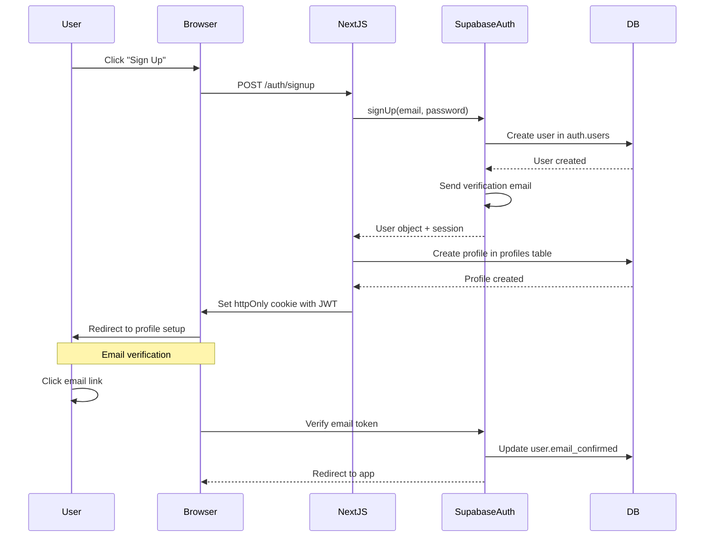

# Backend Architecture

## Service Architecture

Life OS uses **Supabase as the backend**, eliminating the need for custom serverless functions or traditional server architecture for most features. However, we leverage Next.js API Routes for complex server-side operations.

### Serverless Architecture (Next.js API Routes)

#### Function Organization

```
app/api/
├── calculate-bmr/
│   └── route.ts              # BMR calculation with profile update
├── export-data/
│   └── route.ts              # Full user data export to JSON
├── import-data/
│   └── route.ts              # Data import with validation
└── analytics/
    └── summary/
        └── route.ts          # Aggregate analytics calculations
```

#### Function Template

```typescript
// app/api/calculate-bmr/route.ts
import { createRouteHandlerClient } from '@supabase/auth-helpers-nextjs';
import { cookies } from 'next/headers';
import { NextResponse } from 'next/server';
import { Database } from '@/types/database.types';

export async function POST(request: Request) {
  const supabase = createRouteHandlerClient<Database>({ cookies });

  // Authenticate request
  const { data: { user }, error: authError } = await supabase.auth.getUser();
  if (authError || !user) {
    return NextResponse.json({ error: 'Unauthorized' }, { status: 401 });
  }

  // Parse request body
  const { height, weight, age, gender } = await request.json();

  // Validate inputs
  if (!height || !weight || !age || !gender) {
    return NextResponse.json({ error: 'Missing required fields' }, { status: 400 });
  }

  if (height <= 0 || weight <= 0 || age <= 0 || age >= 150) {
    return NextResponse.json({ error: 'Invalid input values' }, { status: 400 });
  }

  // Calculate BMR using Mifflin-St Jeor Equation
  let bmr: number;
  if (gender === 'male') {
    bmr = 10 * weight + 6.25 * height - 5 * age + 5;
  } else if (gender === 'female') {
    bmr = 10 * weight + 6.25 * height - 5 * age - 161;
  } else {
    // Average for 'other'
    const male = 10 * weight + 6.25 * height - 5 * age + 5;
    const female = 10 * weight + 6.25 * height - 5 * age - 161;
    bmr = (male + female) / 2;
  }

  // Update user profile
  const { data: profile, error: updateError } = await supabase
    .from('profiles')
    .update({
      bmr: Math.round(bmr),
      height,
      weight,
      age,
      gender,
      updated_at: new Date().toISOString()
    })
    .eq('id', user.id)
    .select()
    .single();

  if (updateError) {
    return NextResponse.json({ error: updateError.message }, { status: 500 });
  }

  return NextResponse.json({
    bmr: Math.round(bmr),
    profile
  });
}
```

---

## Database Architecture

### Schema Design

See complete schema in **Database Schema** section above. Key design decisions:

1. **User ID as Primary FK**: Every user-owned table has `user_id UUID NOT NULL REFERENCES profiles(id) ON DELETE CASCADE`
2. **Timestamps Everywhere**: All tables have `created_at` and `updated_at` (with triggers)
3. **Unique Constraints**: Prevent duplicates (e.g., one daily entry per user per day)
4. **Check Constraints**: Enforce data validity (e.g., weight > 0, age < 150)
5. **Indexes on Hot Paths**: `(user_id, date)` indexes for fast daily queries

### Data Access Layer

Supabase client provides the data access layer. No ORM needed.

**Repository Pattern Example** (optional, for complex queries):

```typescript
// lib/repositories/food-entries.ts
import { createClientComponentClient } from '@supabase/auth-helpers-nextjs';
import { Database } from '@/types/database.types';

type FoodEntry = Database['public']['Tables']['food_entries']['Row'];
type FoodEntryInsert = Database['public']['Tables']['food_entries']['Insert'];

export class FoodEntriesRepository {
  private supabase = createClientComponentClient<Database>();

  async getEntriesForDate(userId: string, date: string): Promise<FoodEntry[]> {
    const { data, error } = await this.supabase
      .from('food_entries')
      .select('*')
      .eq('user_id', userId)
      .eq('date', date)
      .order('time', { ascending: false });

    if (error) throw error;
    return data || [];
  }

  async createEntry(entry: FoodEntryInsert): Promise<FoodEntry> {
    const { data, error } = await this.supabase
      .from('food_entries')
      .insert(entry)
      .select()
      .single();

    if (error) throw error;
    return data;
  }

  async deleteEntry(entryId: string, userId: string): Promise<void> {
    const { error } = await this.supabase
      .from('food_entries')
      .delete()
      .eq('id', entryId)
      .eq('user_id', userId); // Ensure user owns the entry

    if (error) throw error;
  }

  async getTotalsForDate(userId: string, date: string): Promise<{
    totalCalories: number;
    totalCarbs: number;
    totalProtein: number;
    totalFat: number;
  }> {
    const entries = await this.getEntriesForDate(userId, date);

    return {
      totalCalories: entries.reduce((sum, e) => sum + e.calories, 0),
      totalCarbs: entries.reduce((sum, e) => sum + e.carbs, 0),
      totalProtein: entries.reduce((sum, e) => sum + e.protein, 0),
      totalFat: entries.reduce((sum, e) => sum + e.fat, 0),
    };
  }
}
```

---

## Authentication and Authorization

### Auth Flow



### Middleware/Guards

Auth middleware protects routes (see **Protected Route Pattern** above).

For API routes, use this pattern:

```typescript
// lib/auth/api-guard.ts
import { createRouteHandlerClient } from '@supabase/auth-helpers-nextjs';
import { cookies } from 'next/headers';
import { NextResponse } from 'next/server';
import { Database } from '@/types/database.types';

export async function requireAuth() {
  const supabase = createRouteHandlerClient<Database>({ cookies });
  const { data: { user }, error } = await supabase.auth.getUser();

  if (error || !user) {
    return {
      user: null,
      error: NextResponse.json({ error: 'Unauthorized' }, { status: 401 })
    };
  }

  return { user, error: null };
}

// Usage in API routes:
// const { user, error } = await requireAuth();
// if (error) return error;
```

---
