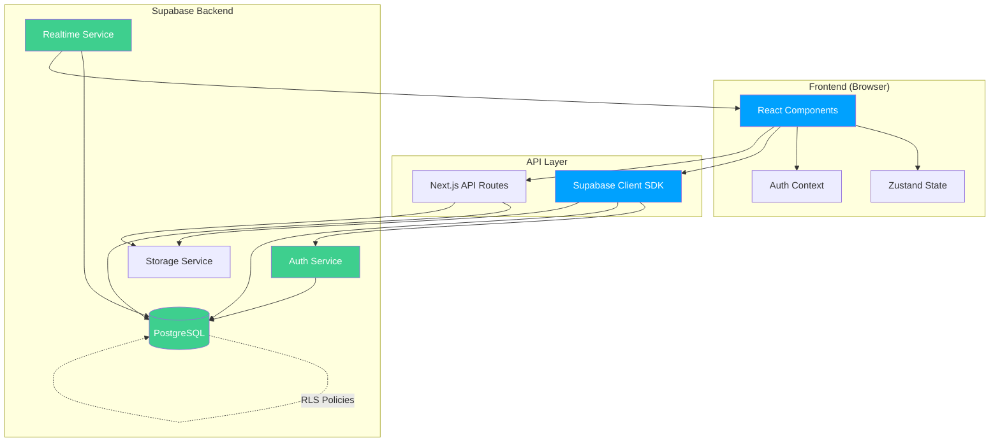

# Components

## Frontend Components

### Navigation Component

**Responsibility:** Provides application-wide navigation with responsive sidebar (desktop) and bottom nav (mobile).

**Key Interfaces:**
- `NavigationProps` - Configuration for active route and user context
- Emits navigation events to analytics

**Dependencies:**
- Next.js Link component
- Heroicons for navigation icons
- User authentication context

**Technology Stack:** React Server Component for initial render, Client Component for interactive state

---

### Daily Tracker Dashboard

**Responsibility:** Central hub displaying MITs, weight entry, quick-action cards, and weekly review (Fridays).

**Key Interfaces:**
- Consumes `Profile`, `DailyEntry`, `MIT[]` data
- Emits actions for MIT creation/completion, weight updates

**Dependencies:**
- Supabase client for data fetching
- Date utilities for timezone-aware current date
- Quick-action card sub-components

**Technology Stack:** React Client Component with Supabase real-time subscriptions

---

### Macro Progress Bars

**Responsibility:** Visual progress indicators for daily macro targets.

**Key Interfaces:**
- `MacroProgressProps` - Current values, target values, macro type
- Color-coded status calculation (green/yellow/red)

**Dependencies:**
- None (pure presentational component)

**Technology Stack:** React Server Component (can be static)

---

### Food Log Table

**Responsibility:** Displays food entries with inline edit/delete, calculates totals.

**Key Interfaces:**
- `FoodLogProps` - Array of `FoodEntry` objects, callback functions
- Emits delete and edit actions

**Dependencies:**
- Supabase client for mutations
- Date formatting utilities

**Technology Stack:** React Client Component with optimistic UI updates

---

### Analytics Charts

**Responsibility:** Renders interactive charts for weight trends, calorie balance, injection consistency.

**Key Interfaces:**
- `ChartProps` - Time range, data array, chart type
- Responsive sizing based on container

**Dependencies:**
- Recharts library
- Date range filtering utilities

**Technology Stack:** React Client Component with lazy loading

---

### Onboarding Wizard

**Responsibility:** Multi-step wizard for first-time user profile setup.

**Key Interfaces:**
- `WizardStep` - Step configuration and validation
- Emits completion event with profile data

**Dependencies:**
- Supabase client for profile creation
- BMR calculator utility

**Technology Stack:** React Client Component with modal overlay

---

### Winners Bible Slideshow

**Responsibility:** Full-screen image viewer with navigation and viewing status tracking.

**Key Interfaces:**
- `SlideshowProps` - Image array, current index, viewing status
- Emits viewing status updates (morning/night)

**Dependencies:**
- Supabase Storage for image URLs
- Keyboard navigation hooks

**Technology Stack:** React Client Component

---

## Backend Services (Supabase)

### Database Service

**Responsibility:** PostgreSQL database with Row Level Security policies.

**Key Interfaces:**
- SQL schema migrations
- RLS policy definitions

**Dependencies:**
- Supabase platform

**Technology Stack:** PostgreSQL 15+, Supabase RLS engine

---

### Authentication Service

**Responsibility:** User registration, login, session management, OAuth.

**Key Interfaces:**
- JWT tokens for session auth
- OAuth provider integration endpoints

**Dependencies:**
- Supabase Auth platform
- Google/GitHub OAuth apps

**Technology Stack:** Supabase Auth (GoTrue)

---

### Storage Service

**Responsibility:** File upload/download for Winners Bible images.

**Key Interfaces:**
- S3-compatible API
- Public/private bucket policies

**Dependencies:**
- Supabase Storage platform

**Technology Stack:** Supabase Storage

---

### Real-time Service

**Responsibility:** WebSocket-based live data synchronization across devices.

**Key Interfaces:**
- Subscription channels per table
- Broadcast events for data changes

**Dependencies:**
- Supabase Realtime platform
- PostgreSQL logical replication

**Technology Stack:** Supabase Realtime (Phoenix Channels)

---

## Component Diagrams

---
