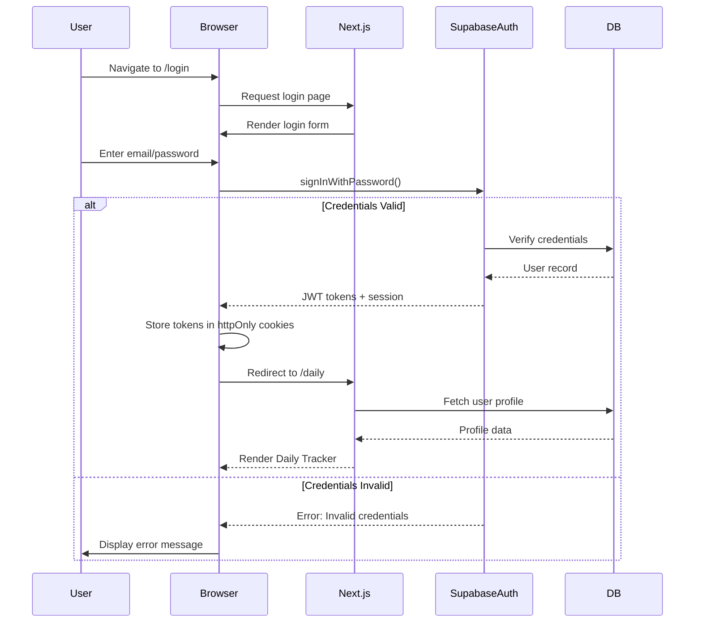
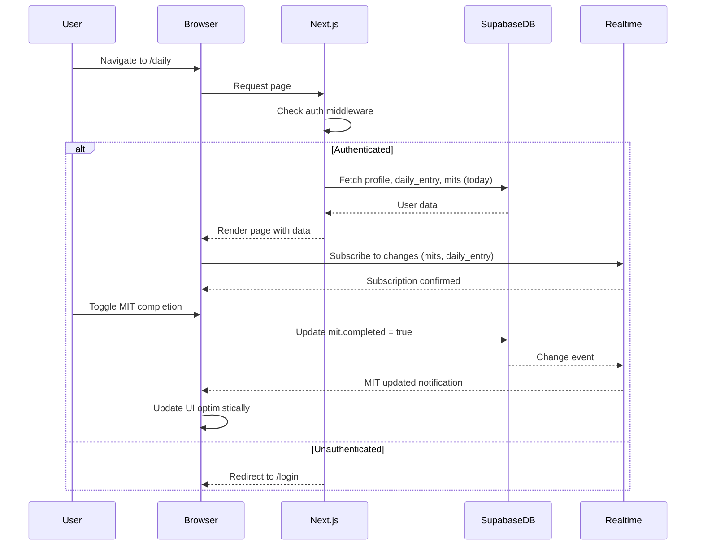
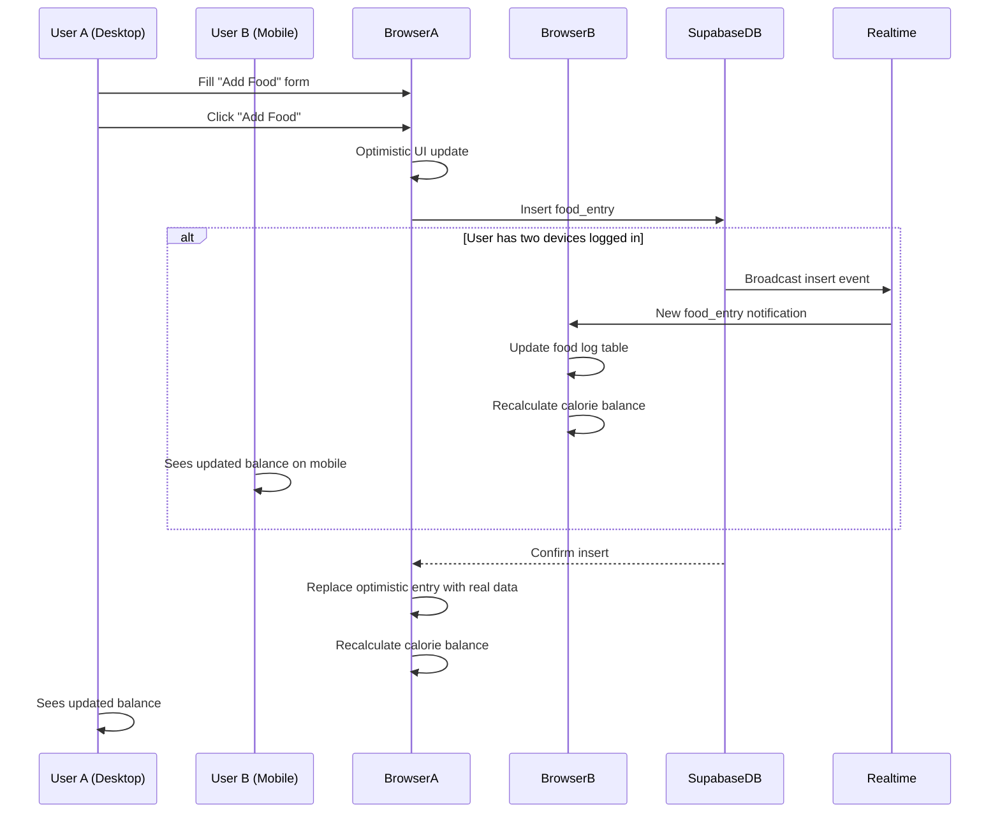
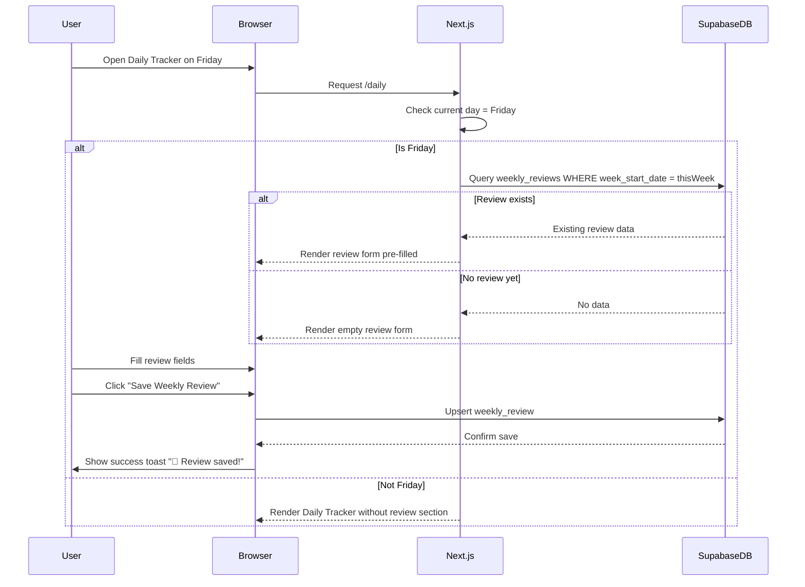

# Core Workflows

## User Authentication Flow

```mermaid
sequenceDiagram
    participant User
    participant Browser
    participant Next.js
    participant SupabaseAuth
    participant DB

    User->>Browser: Navigate to /login
    Browser->>Next.js: Request login page
    Next.js->>Browser: Render login form

    User->>Browser: Enter email/password
    Browser->>SupabaseAuth: signInWithPassword()

    alt Credentials Valid
        SupabaseAuth->>DB: Verify credentials
        DB-->>SupabaseAuth: User record
        SupabaseAuth-->>Browser: JWT tokens + session
        Browser->>Browser: Store tokens in httpOnly cookies
        Browser->>Next.js: Redirect to /daily
        Next.js->>DB: Fetch user profile
        DB-->>Next.js: Profile data
        Next.js-->>Browser: Render Daily Tracker
    else Credentials Invalid
        SupabaseAuth-->>Browser: Error: Invalid credentials
        Browser->>User: Display error message
    end
```

---

## Daily Tracker Load Workflow

```mermaid
sequenceDiagram
    participant User
    participant Browser
    participant Next.js
    participant SupabaseDB
    participant Realtime

    User->>Browser: Navigate to /daily
    Browser->>Next.js: Request page
    Next.js->>Next.js: Check auth middleware

    alt Authenticated
        Next.js->>SupabaseDB: Fetch profile, daily_entry, mits (today)
        SupabaseDB-->>Next.js: User data
        Next.js-->>Browser: Render page with data

        Browser->>Realtime: Subscribe to changes (mits, daily_entry)
        Realtime-->>Browser: Subscription confirmed

        User->>Browser: Toggle MIT completion
        Browser->>SupabaseDB: Update mit.completed = true
        SupabaseDB-->>Realtime: Change event
        Realtime-->>Browser: MIT updated notification
        Browser->>Browser: Update UI optimistically

    else Unauthenticated
        Next.js-->>Browser: Redirect to /login
    end
```

---

## Food Entry with Real-Time Updates

```mermaid
sequenceDiagram
    participant UserA as User A (Desktop)
    participant UserB as User B (Mobile)
    participant BrowserA
    participant BrowserB
    participant SupabaseDB
    participant Realtime

    UserA->>BrowserA: Fill "Add Food" form
    UserA->>BrowserA: Click "Add Food"

    BrowserA->>BrowserA: Optimistic UI update
    BrowserA->>SupabaseDB: Insert food_entry

    alt User has two devices logged in
        SupabaseDB->>Realtime: Broadcast insert event
        Realtime->>BrowserB: New food_entry notification
        BrowserB->>BrowserB: Update food log table
        BrowserB->>BrowserB: Recalculate calorie balance
        UserB->>UserB: Sees updated balance on mobile
    end

    SupabaseDB-->>BrowserA: Confirm insert
    BrowserA->>BrowserA: Replace optimistic entry with real data
    BrowserA->>BrowserA: Recalculate calorie balance
    UserA->>UserA: Sees updated balance
```

---

## Weekly Review Creation (Friday Flow)

```mermaid
sequenceDiagram
    participant User
    participant Browser
    participant Next.js
    participant SupabaseDB

    User->>Browser: Open Daily Tracker on Friday
    Browser->>Next.js: Request /daily
    Next.js->>Next.js: Check current day = Friday

    alt Is Friday
        Next.js->>SupabaseDB: Query weekly_reviews WHERE week_start_date = thisWeek

        alt Review exists
            SupabaseDB-->>Next.js: Existing review data
            Next.js-->>Browser: Render review form pre-filled
        else No review yet
            SupabaseDB-->>Next.js: No data
            Next.js-->>Browser: Render empty review form
        end

        User->>Browser: Fill review fields
        User->>Browser: Click "Save Weekly Review"
        Browser->>SupabaseDB: Upsert weekly_review
        SupabaseDB-->>Browser: Confirm save
        Browser->>User: Show success toast "🎉 Review saved!"

    else Not Friday
        Next.js-->>Browser: Render Daily Tracker without review section
    end
```

---
