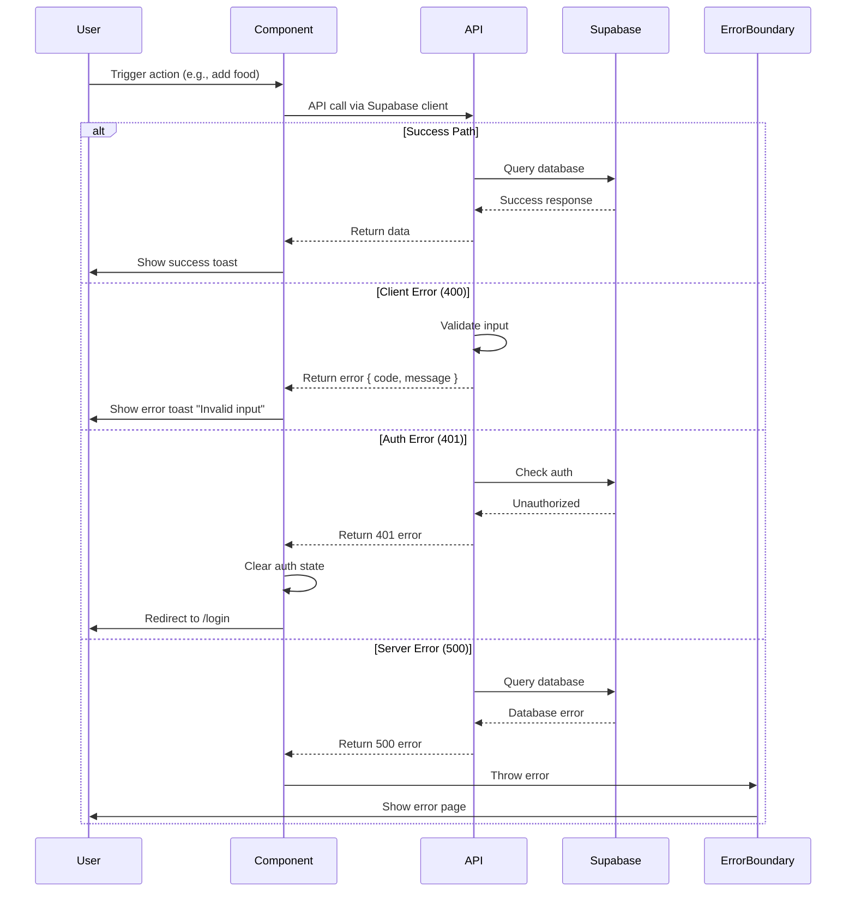

# Error Handling Strategy

## Error Flow



## Error Response Format

All API errors follow this format:

```typescript
interface ApiError {
  error: {
    code: string;           // Machine-readable error code (e.g., "INVALID_INPUT")
    message: string;        // Human-readable error message
    details?: Record<string, any>; // Optional additional context
    timestamp: string;      // ISO 8601 timestamp
    requestId: string;      // Unique request ID for debugging
  };
}
```

## Frontend Error Handling

```typescript
// lib/utils/error-handler.ts
import { toast } from '@/components/ui/Toast';

export function handleError(error: unknown): void {
  console.error('[Error]', error);

  if (error instanceof Error) {
    // Check if it's a Supabase error
    if ('code' in error && 'details' in error) {
      const supabaseError = error as any;

      // Handle specific Supabase error codes
      if (supabaseError.code === '23505') {
        // Unique violation
        toast.error('This record already exists.');
        return;
      }

      if (supabaseError.code === '42501') {
        // RLS policy violation
        toast.error('You do not have permission to perform this action.');
        return;
      }

      // Generic Supabase error
      toast.error(supabaseError.message || 'An error occurred.');
      return;
    }

    // Generic JavaScript error
    toast.error(error.message);
    return;
  }

  // Unknown error type
  toast.error('An unexpected error occurred. Please try again.');
}

// Usage in components:
try {
  await supabase.from('mits').insert({ ... });
} catch (error) {
  handleError(error);
}
```

## Backend Error Handling

```typescript
// app/api/calculate-bmr/route.ts (error handling example)
import { NextResponse } from 'next/server';
import { v4 as uuidv4 } from 'uuid';

export async function POST(request: Request) {
  const requestId = uuidv4();

  try {
    // ... business logic ...

    return NextResponse.json({ bmr, profile });
  } catch (error) {
    console.error(`[${requestId}] Error in calculate-bmr:`, error);

    // Determine error type and status code
    if (error instanceof Error) {
      if (error.message.includes('Unauthorized')) {
        return NextResponse.json({
          error: {
            code: 'UNAUTHORIZED',
            message: 'Authentication required',
            timestamp: new Date().toISOString(),
            requestId,
          }
        }, { status: 401 });
      }

      if (error.message.includes('validation')) {
        return NextResponse.json({
          error: {
            code: 'INVALID_INPUT',
            message: error.message,
            timestamp: new Date().toISOString(),
            requestId,
          }
        }, { status: 400 });
      }
    }

    // Generic server error
    return NextResponse.json({
      error: {
        code: 'INTERNAL_SERVER_ERROR',
        message: 'An unexpected error occurred',
        timestamp: new Date().toISOString(),
        requestId,
      }
    }, { status: 500 });
  }
}
```

---
