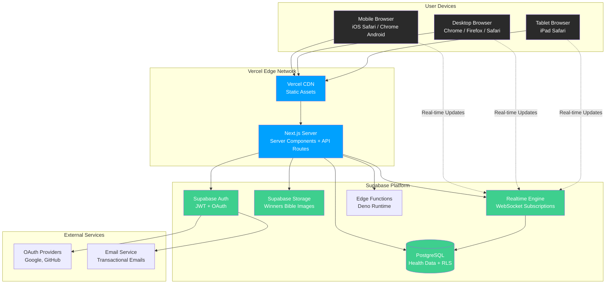

# High Level Architecture

## Technical Summary

Life OS is a serverless full-stack application built on Next.js 14+ (React 18) with Supabase as the backend-as-a-service platform. The architecture follows a **Jamstack + Serverless** pattern where the frontend is deployed as a static/server-rendered application on Vercel's edge network, while backend services (database, authentication, real-time subscriptions, storage) are managed entirely by Supabase. This eliminates devops overhead while providing enterprise-grade security through Row Level Security policies and real-time data synchronization across devices. The application uses TypeScript throughout for type safety, with shared types between client and server. Data flows directly from browser to Supabase using the Supabase client SDK, with Next.js Server Components and API Routes handling server-side operations when needed. This architecture achieves the PRD's goals of multi-device access, real-time analytics, and secure multi-user isolation while maintaining developer velocity and zero infrastructure management.

## Platform and Infrastructure Choice

**Platform:** Vercel + Supabase

**Key Services:**
- **Frontend Hosting**: Vercel (Edge Network, automatic scaling, zero-config)
- **Database**: Supabase PostgreSQL (managed, auto-scaling)
- **Authentication**: Supabase Auth (email/password, OAuth, magic links)
- **Storage**: Supabase Storage (Winners Bible images, profile pictures)
- **Real-time**: Supabase Realtime (WebSocket subscriptions for live data)
- **Edge Functions**: Supabase Edge Functions (Deno runtime, if needed for complex server logic)

**Deployment Host and Regions:**
- **Vercel**: Global edge network (automatic routing to nearest edge)
- **Supabase**: US East (primary region, can configure replication if needed)

**Rationale:**

This platform combination was selected for several key reasons:

1. **Zero DevOps Overhead**: Both Vercel and Supabase are fully managed platforms with automatic scaling, monitoring, and updates
2. **Tight Integration**: Supabase client SDK works seamlessly with Next.js SSR, SSG, and client-side rendering
3. **Real-Time Built-In**: Supabase Realtime satisfies FR23 requirement for instant cross-device synchronization without custom WebSocket infrastructure
4. **Security-First**: Row Level Security policies provide ironclad data isolation between users (NFR3)
5. **Cost-Effective**: Free tiers support development and early production; predictable scaling costs
6. **Developer Experience**: Automatic API generation from database schema, TypeScript support, instant local development with Supabase CLI

## Repository Structure

**Structure:** Monorepo (Single Repository)

**Monorepo Tool:** Not required - Next.js built-in monorepo support with npm workspaces

**Package Organization:**

Since this is a tightly-coupled full-stack application where frontend and backend share extensive types and business logic, we're using a **simplified monorepo structure** leveraging Next.js App Router's built-in server/client separation. No additional monorepo tooling (Turborepo, Nx) is needed for this scale.

```
life-os/
├── src/              # Application code (Next.js convention)
├── supabase/         # Supabase-specific code (migrations, functions)
├── public/           # Static assets
├── tests/            # Test suites
└── docs/             # Documentation
```

This structure keeps related concerns together while maintaining clear boundaries between client code, server code, database schema, and configuration.

## High Level Architecture Diagram



## Architectural Patterns

- **Jamstack Architecture:** Static site generation with serverless APIs - _Rationale:_ Optimal performance and SEO for public pages; dynamic data fetched client-side for authenticated users
- **Serverless Backend:** Supabase manages all backend infrastructure with automatic scaling - _Rationale:_ Eliminates operational complexity, enables focus on business logic
- **Component-Based UI:** Reusable React components with TypeScript - _Rationale:_ Maintainability and type safety across large codebase
- **Row Level Security (RLS):** Database-enforced access control - _Rationale:_ Ironclad data isolation between users; security enforced at data layer rather than application layer
- **Optimistic UI Updates:** Client updates UI immediately, syncs to server asynchronously - _Rationale:_ Perceived performance improvement for user interactions
- **Server Components First:** Default to Next.js Server Components, use Client Components only when needed - _Rationale:_ Reduces JavaScript bundle size, improves initial page load
- **Real-Time Subscriptions:** Supabase Realtime for live data synchronization - _Rationale:_ Satisfies FR23 requirement without custom WebSocket infrastructure
- **API Routes as BFF:** Next.js API routes act as Backend-for-Frontend when complex server-side logic needed - _Rationale:_ Keeps sensitive operations server-side, simplifies client code

---
