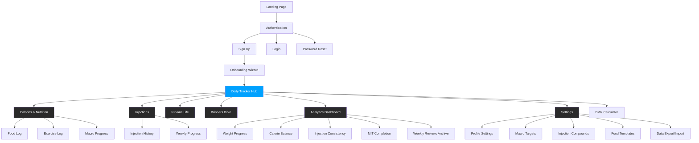
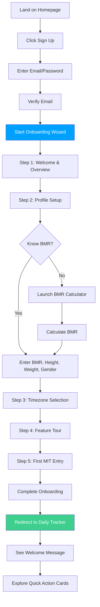
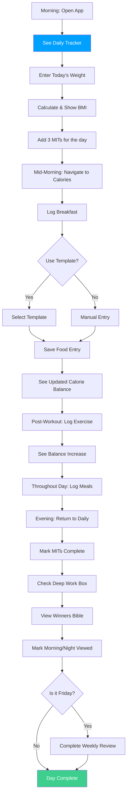
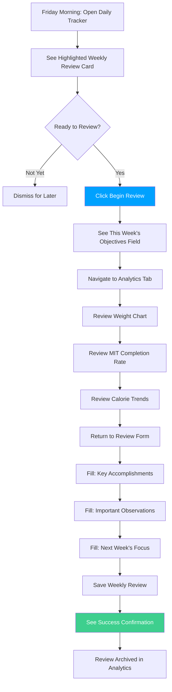

# Life OS UI/UX Specification

**Version:** 1.0
**Date:** 2025-09-30
**Status:** Ready for Implementation
**Project:** Life OS - Comprehensive Health Tracking Platform

---

## Introduction

This document defines the user experience goals, information architecture, user flows, and visual design specifications for Life OS's user interface. It serves as the foundation for visual design and frontend development, ensuring a cohesive and user-centered experience.

### Overall UX Goals & Principles

#### Target User Personas

**1. Health Optimizer (Primary Persona)**
- **Profile**: Data-driven individuals (ages 25-45) who track multiple health metrics to optimize performance and longevity
- **Goals**: Precise tracking of nutrition, injections, weight trends, and daily habits to make informed health decisions
- **Pain Points**: Juggling multiple tracking apps, lack of integration between nutrition and medication tracking, poor data visualization
- **Tech Comfort**: High - comfortable with apps, spreadsheets, wearables
- **Usage Pattern**: Daily logging (morning weight, throughout day for food, evening review)

**2. Fitness Enthusiast**
- **Profile**: Active individuals focused on body composition, macros, and workout performance
- **Goals**: Hit daily macro targets, track calorie balance for cutting/bulking, monitor weight progress
- **Pain Points**: Tedious food logging, inability to create meal templates, poor mobile experience for on-the-go logging
- **Tech Comfort**: Medium-High - uses fitness apps regularly
- **Usage Pattern**: Multiple daily interactions (post-meal logging, post-workout logging)

**3. Habit Builder**
- **Profile**: Individuals focused on consistency and streak-building across multiple lifestyle domains
- **Goals**: Complete daily MITs, maintain weekly review practice, build sustainable health routines
- **Pain Points**: Forgetting to log data, lack of motivational feedback, overwhelming interfaces
- **Tech Comfort**: Medium - prefers simple, focused interfaces
- **Usage Pattern**: Brief check-ins (morning planning, evening completion)

#### Usability Goals

1. **Ease of Learning**: New users can complete core tasks (add MIT, log food, track weight) within 5 minutes of account creation
2. **Efficiency of Use**: Power users can log a food entry in under 15 seconds using templates; complete daily review in under 2 minutes
3. **Error Prevention**: Clear validation on all numeric inputs; confirmation dialogs for destructive actions (delete data, clear history)
4. **Memorability**: Infrequent users (weekly review only) can return without relearning navigation or workflows
5. **Satisfaction**: Users feel accomplished and motivated through clear progress visualization and completion feedback

#### Design Principles

1. **Data Density with Clarity** - Present comprehensive health data without overwhelming; use cards, hierarchy, and whitespace to organize information logically
2. **Instant Feedback** - Every action (logging food, marking MIT complete, entering weight) shows immediate visual response and updates related calculations in real-time
3. **Progressive Disclosure** - Core features front and center; advanced settings and historical data accessible but not prominent; Friday-only weekly review appears contextually
4. **Dark Theme Focus** - Reduce eye strain for frequent users; premium aesthetic; strategic use of bright blue (#00A1FE) for primary actions creates strong visual hierarchy
5. **Mobile-First Interactions** - Touch-optimized targets (minimum 44px); bottom navigation for thumbs; inline editing to minimize navigation

### Change Log

| Date | Version | Description | Author |
|------|---------|-------------|--------|
| 2025-09-30 | 1.0 | Initial UI/UX specification for Life OS | Sally (UX Expert) |

---

## Information Architecture (IA)

### Site Map / Screen Inventory



### Navigation Structure

**Primary Navigation (Desktop Sidebar / Mobile Bottom Bar)**

Desktop users see a persistent left sidebar (256px width) with full labels. Mobile users see a fixed bottom navigation bar with the 4 most-used pages plus a "More" menu.

| Icon | Label | Route | Mobile Priority | Description |
|------|-------|-------|-----------------|-------------|
| HomeIcon | Daily | /daily | High | Daily tracking hub with MITs, weight, quick actions |
| FireIcon | Calories | /calories | High | Food and exercise logging with macro tracking |
| BeakerIcon | Injections | /injections | High | Injection logging and weekly progress |
| ChartBarIcon | Analytics | /analytics | High | Data visualization and historical trends |
| UserIcon | Nirvana | /nirvana | Low (More menu) | Mobility session tracking |
| BookOpenIcon | Winners Bible | /winners-bible | Low (More menu) | Motivational image slideshow |
| CalculatorIcon | BMR Calculator | /bmr-calculator | Low (More menu) | BMR calculation tool |
| CogIcon | Settings | /settings | Low (More menu) | Configuration and preferences |

**Active State Styling:**
- Desktop: Full-width blue background (#00A1FE) with white text
- Mobile: Blue icon color with label text below
- Both: Solid icon variant (Heroicons solid) for active, outline for inactive

**Secondary Navigation:**
- Top header on desktop: Logo (left), horizontal nav links (center), user menu + settings icon (right)
- Mobile hamburger menu: Slides in from right, shows all pages not in bottom bar

**Breadcrumb Strategy:**
- Not used - flat navigation structure with clear page titles eliminates need
- Date navigation on relevant pages (Daily, Calories, Injections) provides temporal context

---

## User Flows

### Flow 1: First-Time User Onboarding

**User Goal:** Complete account setup and understand how to use core tracking features

**Entry Points:**
- Landing page CTA ("Get Started" button)
- Direct signup link from marketing materials

**Success Criteria:**
- User completes profile with BMR, gender, height, weight, timezone
- User understands the Daily Tracker hub as the home base
- User has added at least 1 MIT or logged 1 piece of data

#### Flow Diagram



#### Edge Cases & Error Handling:

- **Email already exists**: Show clear error with "Login instead?" link
- **Weak password**: Real-time validation with strength indicator
- **BMR calculation confusion**: Provide explanation text and example values
- **Skip onboarding attempt**: Allow skip but show persistent banner to complete profile
- **Network timeout during signup**: Save partial progress, allow resume

**Notes:** Onboarding should feel welcoming but concise (target 5-10 minutes). Allow users to skip and complete later, but profile data is required for calorie balance calculations to work.

---

### Flow 2: Daily Tracking Routine

**User Goal:** Complete daily health tracking tasks efficiently

**Entry Points:**
- Morning: Open app → Daily Tracker (default view)
- Throughout day: Return to log food, exercise, injections
- Evening: Complete MITs, mark deep work, review Winners Bible

**Success Criteria:**
- All daily tracking completed in under 5 minutes total (across multiple sessions)
- User feels sense of accomplishment from completing items
- Data accurately captured for analytics

#### Flow Diagram



#### Edge Cases & Error Handling:

- **Forgot to log breakfast**: Date picker allows retroactive entry for any time today
- **Entered wrong food data**: Inline edit or delete button on each entry
- **Can't remember exact calories**: Provide common food database search (future enhancement)
- **Multiple devices**: Real-time sync ensures data consistency
- **Offline logging**: Show pending indicator, sync when online

**Notes:** This is the most frequent flow. Optimize for speed with templates, autofill current time, and inline editing. Mobile experience critical here.

---

### Flow 3: Friday Weekly Review

**User Goal:** Reflect on the week's progress and set intentions for next week

**Entry Points:**
- Friday: Prominent "Weekly Review" card appears on Daily Tracker
- Notification/reminder (optional future feature)

**Success Criteria:**
- User completes all 4 reflection fields
- Review saved and accessible in Analytics archive
- User feels motivated and prepared for next week

#### Flow Diagram



#### Edge Cases & Error Handling:

- **Miss Friday deadline**: Review card stays visible through weekend, disappears Monday
- **Incomplete form**: Allow save as draft, show completion indicator
- **Want to review mid-week**: Access via Analytics → Weekly Reviews tab anytime
- **Lost progress**: Auto-save draft every 30 seconds
- **Multiple reviews in one week**: Only one review per week allowed, edit existing

**Notes:** This is a reflective, slower-paced flow (15-20 minutes). Provide ample space for text input, consider prompts/questions to guide reflection.

---

## Component Library / Design System

**Design System Approach:** Life OS uses a custom design system (located in `/design-system/`) built on Tailwind CSS 4.0 with distinctive branding elements. All components follow dark theme patterns with strategic blue accent usage.

### Core Components

#### Button Component

**Purpose:** Primary and secondary call-to-action buttons with distinctive 100px border radius

**Variants:**
- `btn-primary`: Bright blue background (#00A1FE), white text, 100px border radius
- `btn-secondary`: Outlined button with gray border, transparent background, hover effects

**States:**
- Default: Base styling as defined
- Hover: Scale slightly (1.02), brightness increase
- Active: Scale down (0.98), darker shade
- Disabled: Reduced opacity (0.5), no pointer events
- Loading: Spinner icon, disabled state

**Usage Guidelines:**
- Use primary buttons sparingly (1-2 per screen) for main actions
- Secondary buttons for less critical actions or cancel operations
- Minimum width 120px for text clarity
- Icon + text combinations supported with 8px gap

```tsx
<button className="btn-primary">Add MIT</button>
<button className="btn-secondary">Cancel</button>
```

---

#### Card Component

**Purpose:** Content containers for grouping related information with dark theme styling

**Variants:**
- `card`: Standard dark card (#2a2a2a background, subtle border)
- `glass-card`: Glassmorphism effect with backdrop blur and transparency
- `card-interactive`: Hover effects for clickable cards (Quick Action Cards)

**States:**
- Default: Static card with border
- Hover (interactive only): Border color change to blue, slight elevation
- Focus: Blue outline for keyboard navigation

**Usage Guidelines:**
- Use cards to group related data (MITs section, Weight Tracking, Macro Progress)
- Maintain consistent padding (16px mobile, 24px desktop)
- Stack vertically on mobile, grid layout on desktop
- Quick Action Cards should use interactive variant

```tsx
<div className="card">
  <h3>Today's MITs</h3>
  {/* Content */}
</div>
```

---

#### Input Field Component

**Purpose:** Form inputs for text, numbers, dates, and selections with dark theme styling

**Variants:**
- `input-field`: Standard text/number input
- `select-field`: Dropdown selector
- `textarea` with `input-field`: Multi-line text input

**States:**
- Default: Dark background (#2a2a2a), gray border, white text
- Focus: Blue ring (#00A1FE), blue border
- Error: Red border, error message below
- Disabled: Reduced opacity, gray background
- Success: Green border (after validation passes)

**Usage Guidelines:**
- Always pair with visible labels (not just placeholders)
- Show validation errors inline below field
- Use appropriate input types (number for weight/calories, time for timestamps)
- Minimum touch target 44px height on mobile

```tsx
<label className="block text-sm mb-2">Weight (kg)</label>
<input
  type="number"
  step="0.1"
  className="input-field"
  placeholder="Enter weight"
/>
```

---

#### Progress Bar Component

**Purpose:** Visual representation of progress toward macro targets and goals

**Variants:**
- Horizontal bar with percentage fill
- Color-coded: Green (90-110% of target), Yellow (70-89% or 111-120%), Red (<70% or >120%)

**States:**
- Filling: Animated fill on value change
- Complete: 100% with checkmark icon
- Over-target: Red fill extending beyond bar

**Usage Guidelines:**
- Display current/target values as text above bar
- Show percentage to right of bar
- Animate transitions smoothly (0.3s ease)
- Use consistent height (12px desktop, 10px mobile)

```tsx
<div className="flex items-center gap-4">
  <div className="flex-1 bg-dark2 h-3 rounded-full overflow-hidden">
    <div className="bg-primary h-full transition-all" style={{width: '75%'}}></div>
  </div>
  <span className="text-sm">1500 / 2000 cal (75%)</span>
</div>
```

---

## Branding & Style Guide

### Visual Identity

**Brand Guidelines:** Life OS employs a custom design system emphasizing dark themes, data density, and premium aesthetics for health-conscious power users.

### Color Palette

| Color Type | Hex Code | Usage |
|------------|----------|-------|
| Primary | #00A1FE | Primary buttons, active navigation, chart highlights, focus states |
| Dark | #1f1f1f | Main background, body background |
| Dark Elevated | #2a2a2a | Cards, modals, input backgrounds, elevated surfaces |
| White | #FFFFFF | Primary text, headings, high contrast elements |
| Gray | #ABABAB | Secondary text, placeholders, borders, inactive states |
| Success | #3ECF8E | Positive feedback, completion indicators, on-target status |
| Warning | #FFA500 | Cautions, approaching limits, needs attention |
| Error | #FF4444 | Errors, over-limit indicators, destructive action warnings |

### Typography

#### Font Families

- **Primary (Headings):** National2Condensed - Bold, condensed sans-serif creating strong visual hierarchy
- **Secondary (Body):** ESKlarheit - Clean, modern sans-serif optimized for readability
- **Monospace:** System monospace for numeric data, code, timestamps

#### Type Scale

| Element | Size | Weight | Line Height | Usage |
|---------|------|--------|-------------|-------|
| H1 | 2.5rem (40px) | Bold | 1.2 | Page titles |
| H2 | 2rem (32px) | Bold | 1.3 | Section headings |
| H3 | 1.5rem (24px) | Bold | 1.4 | Card titles, subsections |
| H4 | 1.25rem (20px) | Bold | 1.5 | Sub-card headings |
| Body | 1rem (16px) | Regular | 1.6 | Primary body text |
| Small | 0.875rem (14px) | Regular | 1.5 | Helper text, captions, timestamps |
| Tiny | 0.75rem (12px) | Regular | 1.4 | Meta information, footnotes |

### Iconography

**Icon Library:** Heroicons 2.1+ (https://heroicons.com)

**Usage Guidelines:**
- Use outline icons for inactive/default states
- Use solid icons for active states, completed items, emphasis
- Standard size: 24px (1.5rem) for navigation and headers
- Inline size: 16px (1rem) for inline text icons
- Always provide aria-labels for accessibility
- Maintain 1:1 aspect ratio

**Common Icon Mappings:**
- HomeIcon: Daily Tracker
- FireIcon: Calories
- BeakerIcon: Injections
- UserIcon: Nirvana
- BookOpenIcon: Winners Bible
- ChartBarIcon: Analytics
- CogIcon: Settings
- CalculatorIcon: BMR Calculator
- CheckCircleIcon: Completed states
- PlusIcon: Add actions
- TrashIcon: Delete actions

### Spacing & Layout

**Grid System:** 12-column grid with responsive breakpoints

**Breakpoints:**
- Mobile: 0-640px (single column layouts)
- Tablet: 641px-1024px (2-column layouts, collapsible sidebar)
- Desktop: 1025px+ (multi-column, persistent sidebar)

**Spacing Scale:**
```css
--space-1: 0.25rem (4px)
--space-2: 0.5rem (8px)
--space-3: 0.75rem (12px)
--space-4: 1rem (16px)
--space-6: 1.5rem (24px)
--space-8: 2rem (32px)
--space-12: 3rem (48px)
--space-16: 4rem (64px)
```

**Layout Principles:**
- Card padding: 16px (mobile), 24px (desktop)
- Section spacing: 32px vertical gap between major sections
- Form field spacing: 16px between fields
- Navigation spacing: 48px sidebar width, 64px header height

---

## Accessibility Requirements

### Compliance Target

**Standard:** WCAG 2.1 AA Compliance

### Key Requirements

**Visual:**
- Color contrast ratios: Minimum 4.5:1 for normal text, 3:1 for large text and UI components
- Focus indicators: 2px blue outline on all interactive elements, clearly visible on dark background
- Text sizing: Minimum 14px (0.875rem) for body text, user can zoom to 200% without loss of functionality

**Interaction:**
- Keyboard navigation: All functionality accessible via keyboard (Tab, Enter, Space, Arrow keys)
- Screen reader support: Semantic HTML5 elements, ARIA labels on custom components, skip-to-content link
- Touch targets: Minimum 44x44px for all interactive elements on mobile

**Content:**
- Alternative text: All images, icons, and charts have descriptive alt text or aria-labels
- Heading structure: Logical h1-h6 hierarchy, no skipped levels
- Form labels: Every input has associated label, error messages announced to screen readers

### Testing Strategy

- Automated testing with axe-core or Lighthouse accessibility audit
- Manual keyboard navigation testing for all user flows
- Screen reader testing with NVDA (Windows) and VoiceOver (Mac/iOS)
- Color contrast validation using WebAIM Contrast Checker
- Focus management testing (modals, dropdowns, dynamic content)

---

## Responsiveness Strategy

### Breakpoints

| Breakpoint | Min Width | Max Width | Target Devices | Layout Changes |
|------------|-----------|-----------|----------------|----------------|
| Mobile | 0px | 640px | Phones (iPhone, Android) | Single column, bottom nav, stacked cards |
| Tablet | 641px | 1024px | Tablets (iPad, Android tablets) | 2-column grids, collapsed sidebar, top nav |
| Desktop | 1025px | 1440px | Laptops, small monitors | Multi-column, persistent sidebar, full features |
| Wide | 1441px | - | Large monitors (1920px+) | Max-width containers, increased spacing, larger charts |

### Adaptation Patterns

**Layout Changes:**
- Mobile: Single column, full-width cards, bottom navigation
- Tablet: 2-column grid for cards, icon-only sidebar or hamburger menu
- Desktop: 3-column layouts where appropriate, 256px sidebar, multi-column tables

**Navigation Changes:**
- Mobile: Fixed bottom bar (4 main pages) + hamburger menu for additional pages
- Tablet: Top horizontal nav with icon + label, collapsible sidebar
- Desktop: Persistent left sidebar with full labels, top header with horizontal nav

**Content Priority:**
- Mobile: Most important data at top, progressive disclosure, collapsible sections
- Tablet: More data visible, side-by-side comparisons
- Desktop: Data-dense layouts, multiple charts visible simultaneously

**Interaction Changes:**
- Mobile: Touch-optimized (44px targets), swipe gestures for navigation, inline editing preferred over modals
- Tablet: Hybrid touch + mouse, modals for forms
- Desktop: Mouse-optimized hover states, keyboard shortcuts, multi-select capabilities

---

## Animation & Micro-interactions

### Motion Principles

All animations serve functional purposes (feedback, transition, attention) rather than pure decoration. Motion follows these principles:
- **Fast transitions** (0.2s) for immediate feedback (button hover, checkbox toggle)
- **Medium transitions** (0.3s) for content changes (card expansion, progress bar fill)
- **Slow transitions** (0.5s) for page transitions and modals
- **Ease-out timing** for most animations (elements decelerate naturally)
- **Respect prefers-reduced-motion** - disable non-essential animations for users who prefer reduced motion

### Key Animations

- **Button press feedback:** Scale down to 0.98 on click, return to 1.0 (Duration: 0.1s, Easing: ease-in-out)
- **Card hover:** Translate up 2px, border color to blue (Duration: 0.2s, Easing: ease-out)
- **Progress bar fill:** Animated width change (Duration: 0.3s, Easing: ease-out)
- **Checkbox toggle:** Checkmark fade-in with slight scale (Duration: 0.2s, Easing: ease-out)
- **Modal enter:** Fade-in background + scale-up modal (Duration: 0.3s, Easing: ease-out)
- **Toast notification:** Slide in from top + fade-in (Duration: 0.3s, Easing: ease-out), auto-dismiss after 3s with fade-out
- **Page transitions:** Fade between routes (Duration: 0.2s, Easing: ease-in-out)
- **MIT completion:** Strikethrough text with fade to 50% opacity (Duration: 0.3s, Easing: ease-out)

---

## Performance Considerations

### Performance Goals

- **Page Load:** Initial page load under 2 seconds on 4G connection, Largest Contentful Paint (LCP) < 2.5s
- **Interaction Response:** Button clicks respond within 100ms, form submissions provide immediate feedback
- **Animation FPS:** All animations maintain 60fps, no jank on scrolling or interactions

### Design Strategies

- **Lazy load charts:** Load Recharts components only when Analytics tabs are viewed
- **Image optimization:** Use Next.js Image component for Winners Bible images, lazy loading below fold
- **Font loading:** Use font-display: swap for custom fonts, preload critical fonts
- **Code splitting:** Separate bundles per route (automatic with Next.js App Router)
- **Skeleton loaders:** Show content placeholders while data fetches (cards, tables)
- **Debounce inputs:** Debounce search/filter inputs by 300ms to reduce API calls
- **Virtual scrolling:** For long lists (historical data, injection history), implement virtualization
- **Real-time throttling:** Throttle Supabase real-time updates to max 1 per second per subscription

---

## Next Steps

### Immediate Actions

1. **Review with stakeholders** - Present this specification to product owner and technical lead for feedback
2. **Create high-fidelity mockups** - Design detailed mockups in Figma for key screens (Daily Tracker, Calories, Analytics Dashboard)
3. **Build component library** - Implement core components (Button, Card, Input, ProgressBar) in Storybook for developer reference
4. **Validate with users** - Conduct usability testing of onboarding flow mockups with 3-5 target users
5. **Prepare architecture alignment** - Review with Winston (Architect) to ensure frontend spec aligns with technical architecture document

### Design Handoff Checklist

- [x] All user flows documented (Onboarding, Daily Tracking, Weekly Review)
- [x] Component inventory complete (Button, Card, Input, ProgressBar, Navigation)
- [x] Accessibility requirements defined (WCAG 2.1 AA target with specific guidelines)
- [x] Responsive strategy clear (Mobile-first with 4 breakpoints and adaptation patterns)
- [x] Brand guidelines incorporated (Design system with colors, typography, iconography)
- [x] Performance goals established (2s load time, 100ms interaction, 60fps animations)

---

**Document Status:** ✅ Complete and ready for implementation

**Next Agent:** Winston (Architect) should validate alignment between this UX specification and the technical architecture document
